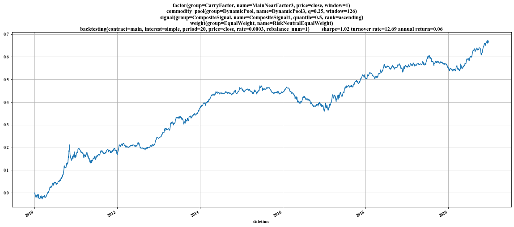
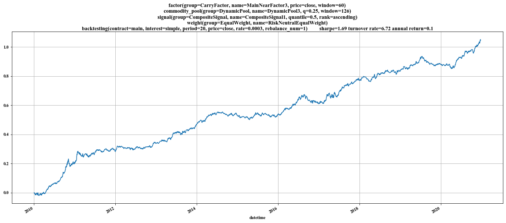
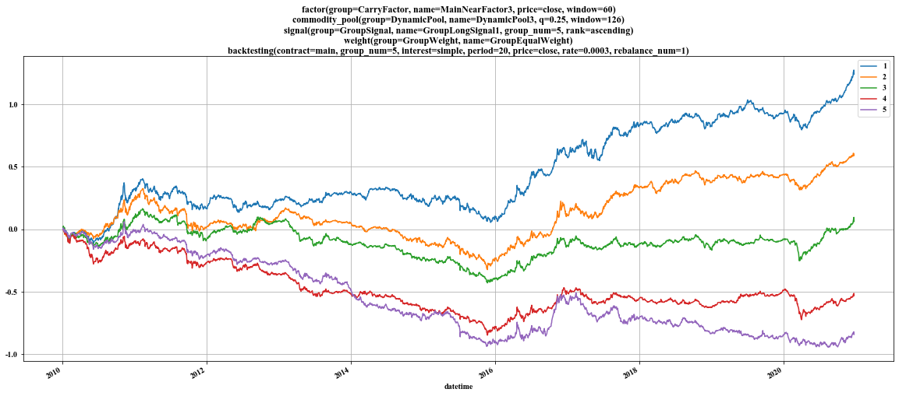
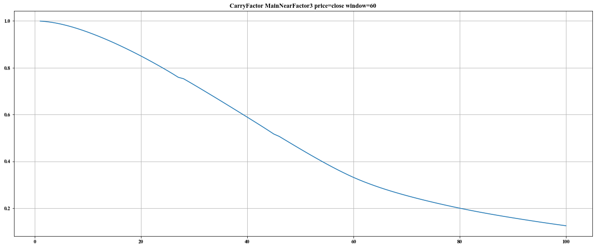
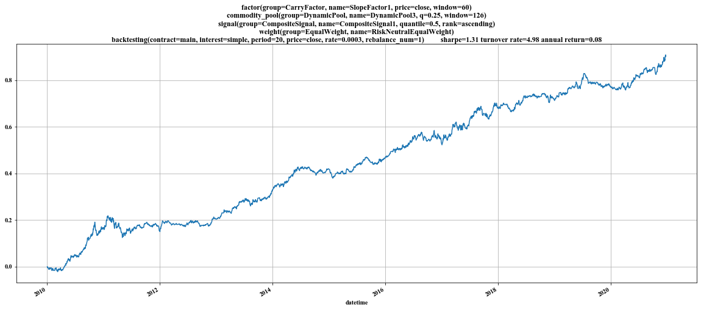
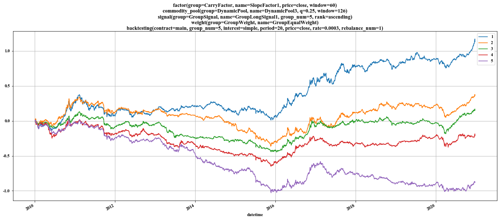

# Carry Factor for Commodity Futures

## Reference Article

I choose one article in zhihu, one popular Chinese website where people can ask questions and connect with people who contribute unique insights: \
**如何构建稳健的商品期货carry组合？**: https://zhuanlan.zhihu.com/p/46197447

# Data

To run the code, you need to download the data from baidu yunpan, the url is:

链接：https://pan.baidu.com/s/1qC0aIvdy1XcrVlRtUMrlQQ 
提取码：nc39 

**After download the data, you need to put the data folder in the path where the folder backtesting is put.**

## Carry Factor

Carry factor is a very useful but simple one for commodity futures.  As we all know, there are several contracts with different maturity date for every kind of commodity futures. For example, in March 1st, 2021, there are IF2103, IF2104, IF2106, IF2106 for IF. However, although they are all IFs, but these contracts have different prices due to their different maturity dates, which is the reason why the carry factor is useful.

Normally, we define carry factor as (S-F)/(F*t2), where S is the price of the spot and F is the price of futures, t2 is the time between now and the maturity date of the futures. But this formula is just a theoretical one, since normally we cannot get the price of the spot.  As a consequence, we find different ways to compute the value of the carry factor:

1. the first way is to select two contracts for one kind of futures.  In this case, we have three choices obviously:

   a. main contract and sub main contract (the near contract as S, the far contract as F)

   b. near contract and sub near contract

   c. main contract and near contract(the nearest contract except the main contract)

2. the slope of y (the natrual logarithm of the price of different contracts) and x(the natural dates between the maturity dates of different contracts and the maturity date of the nearest contract).

# Construction of the backtesting framework

The backtesting framework is composed of the following parts:

1. bases
2. factor
3. commodity pool
4. signals
5. weight
6. backtesting
7. factor_test

# bases

As we all know,  factors, commodity pools, signals, weight, backtesting are all with params. One question we need to tackle is to deal with senarios with many different params. I learn a very sueful way from the way of managing params of BaseEstimator in sklearn. we can make as keywrod argument of the contruction method of every class involving params. For further reference, please visit the website:  
https://scikit-learn.org/stable/modules/generated/sklearn.base.BaseEstimator.html

For example, if we have a factor named A with params R=5, H=10, then we just need to instantiate:


```python
from bases.base import BaseClass

class A(BaseClass):
    def __init__(self, R: int, H: int = 10) -> None:
        super().__init__(R=R, H=H)
```


```python
a = A(R=5, H=10)
```


```python
a.get_params()
```


    {'H': 10, 'R': 5}


```python
a.set_params(R=20, H=5)
a.get_params()
```


    {'H': 5, 'R': 20}


From the example above, we can know that one class inheriting from BaseClass can have several parameters. Once an instance of this class is instantiated, we need to specify the parameters. Besides, we can use the method **get_params** to get the parameters and we can also use the method **set_params** to set or change the parameters.


**In my framework, factor class, signal class, weight class and backtesting class are all inherited from BaseClass.** As a consequence, we apply this method of managine parameters in the same way.

# factor

## factor group and name

In the factor package, I define a class named BaseFactor, which is the base class of all factors. And every factor has its own group and name. Sometimes, we may also define a base class for every factor group. For example, every carry factor is inherited from the BaseCarryFactor, while the BaseCarryFactor is inherited from the BaseCalss.

For example, in the factor package, there is one folder named CarryFactor and in the folder there are several .py file such as FarNearFactor.py, MainNearFactor1.py, MainNearFactor2.py, etc. And in every .py file, there is one class with the same name as the .py file, which is how the factor is defined. For the MainNearFactor3, its group is CarryFactor and its name is MainNearFactor3. For the factor MainNearFactor3, it is a kind of CarryFactor and its name is MainNearFactor3.

## How to define a new factor

To define a new factor, we need to specfy its group and name. If it is included in a new group, you can create a new python package in the factor package. Otherwise, the .py file of the new factor can be in an existing python package, which means it is in this group.

### common method: compute_factor

The method compute_factor is an abstractmethod in the BaseClass. Therefore, every factor must redefine this method. This method is the place where we define how to compute the factor.

The following is the source code of MainNearFactor3.


```python
import numpy as np
import pandas as pd
from tqdm import tqdm
from pandas import DataFrame

from factor.CarryFactor.base import BaseCarryFactor
from utils.utility import stack_dataframe_by_fields
from factor.contract_utility import get_near_contract_except_main

class MainNearFactor3(BaseCarryFactor):
    """
    利用主力合约和去除主力合约后最近合约计算的期限结构因子

    合约: 主力合约和去除主力合约后最近合约，两者中近的合约定义为近月合约，远的合约定义为远月合约. 若合约只有一个，则因子值为缺失值

    时间差: 月份差

    计算方法: (近月合约价格-远月合约价格)/(远月合约价格*时间差)

    Attributes
    __________
    price: str
            用于代表合约价格的字段, close或settlement

    window: int
            因子平滑参数，所有因子都具有

    See Also
    ________
    factor.CarryFactor.bases.BaseFactor
    """

    def __init__(self, price: str = 'close', window: int = 1):
        """
        Constructor

        Parameters
        ----------
        price: str
                用于代表合约价格的字段，close或settlement

        window: int
                因子平滑参数，所有因子都具有
        """
        super().__init__(price=price, window=window)

    def compute_single_factor(self, symbol: str) -> DataFrame:
        """
        计算单品种的因子值

        Parameters
        ----------
        symbol: str
                品种代码

        Returns
        -------
        因子值: DataFrame
                默认的index, 三列, datetime, underlying_symbol(均为symbol), factor
        """
        params = self.get_params()
        price = params['price']
        main_contract_df = self.get_continuous_contract_data(symbol=symbol, price=price)
        main_contract_df = main_contract_df[['datetime', 'contract_before_shift']]\
            .rename(columns={'contract_before_shift': 'main_contract'})

        # 获取除主力合约以外的近月合约
        price_df: DataFrame = self.get_field(symbol=symbol, field=price)
        stack_price_df: DataFrame = price_df.stack().to_frame("price").reset_index()
        near_contract_df = get_near_contract_except_main(price_df, main_contract_df)

        # 获取每个合约的到期日
        maturity_date = self.get_maturity_date(symbol)

        # 预先拼接工作
        main_contract_df = pd.merge(left=main_contract_df,
                                    right=maturity_date.rename(columns={'contract': 'main_contract',
                                                                        'maturity_date':
                                                                            'main_contract_maturity_date'}),
                                    on='main_contract', how='left')

        main_contract_df = pd.merge(left=main_contract_df,
                                    right=stack_price_df.rename(
                                        columns={'contract': 'main_contract', 'price': 'main_price'}),
                                    on=['datetime', 'main_contract'], how='left')

        near_contract_df = pd.merge(left=near_contract_df,
                                    right=maturity_date.rename(columns={'contract': 'near_contract',
                                                                        'maturity_date':
                                                                            'near_contract_maturity_date'}),
                                    on='near_contract', how='left')

        near_contract_df = pd.merge(left=near_contract_df,
                                    right=stack_price_df.rename(
                                        columns={'contract': 'near_contract', 'price': 'near_price'}),
                                    on=['datetime', 'near_contract'], how='left')

        # factor: 因子值
        main_near_df = pd.concat([main_contract_df.set_index('datetime'), near_contract_df.set_index('datetime')],
                                 axis=1).reset_index()
        main_near_df.index = range(len(main_near_df))
        # 远月合约价格
        main_near_df['far_price'] = pd.Series(np.where(main_near_df['main_contract'] > main_near_df['near_contract'],
                                                       main_near_df['main_price'],
                                                       main_near_df['near_price']))

        main_near_df['near_close'] = pd.Series(np.where(main_near_df['main_contract'] < main_near_df['near_contract'],
                                                        main_near_df['main_price'],
                                                        main_near_df['near_price']))

        main_near_df['far_contract'] = pd.Series(np.where(main_near_df['main_contract'] > main_near_df['near_contract'],
                                                          main_near_df['main_contract'],
                                                          main_near_df['near_contract']))

        main_near_df['near_contract'] = pd.Series(
            np.where(main_near_df['main_contract'] < main_near_df['near_contract'],
                     main_near_df['main_contract'],
                     main_near_df['near_contract']))

        main_near_df['near_maturity_date'] = pd.Series(
            np.where(main_near_df['main_contract_maturity_date'] < main_near_df['near_contract_maturity_date'],
                     main_near_df['main_contract_maturity_date'],
                     main_near_df['near_contract_maturity_date']))

        main_near_df['far_maturity_date'] = pd.Series(
            np.where(main_near_df['main_contract_maturity_date'] > main_near_df['near_contract_maturity_date'],
                     main_near_df['main_contract_maturity_date'],
                     main_near_df['near_contract_maturity_date']))

        # main_near_df['date_delta'] = (main_near_df['near_maturity_date'] -
        #                               main_near_df['far_maturity_date']).dt.days

        main_near_df['far_year_month'] = pd.to_datetime('20' + main_near_df['far_contract'].str[-4:] + '01')
        main_near_df['far_year'] = main_near_df['far_year_month'].dt.year
        main_near_df['far_month'] = main_near_df['far_year_month'].dt.month

        main_near_df['near_year_month'] = pd.to_datetime('20' + main_near_df['near_contract'].str[-4:] + '01')
        main_near_df['near_year'] = main_near_df['near_year_month'].dt.year
        main_near_df['near_month'] = main_near_df['near_year_month'].dt.month

        main_near_df['month_delta'] = -((main_near_df['far_year'] - main_near_df['near_year']) * 12 +
                                        (main_near_df['far_month'] - main_near_df['near_month']))

        main_near_df['factor'] = (main_near_df['near_price'] - main_near_df['far_price']) / (main_near_df['far_price'] *
                                                                                             main_near_df[
                                                                                                 'month_delta'])

        main_near_df = main_near_df[['datetime', 'near_contract', 'far_contract',
                                    'near_price', 'far_price',
                                    'month_delta', 'factor']]

        main_near_df['underlying_symbol'] = symbol
        factor =main_near_df[['datetime', 'underlying_symbol', 'factor']]
        return factor

    def compute_factor(self) -> DataFrame:
        """
        计算因子，通过对compute_single_factor实现

        Returns
        -------
        因子值: DataFrame
                index为datetime, columns为underlying_symbol, data为factor
        """

        symbol_list = self.get_symbol_list()
        factor_list = []
        for symbol in tqdm(symbol_list):
            factor = self.compute_single_factor(symbol)
            factor_list.append(factor)
        factor = pd.concat(factor_list, axis=0)
        factor = stack_dataframe_by_fields(data=factor,
                                           index_field='datetime',
                                           column_field='underlying_symbol',
                                           data_field='factor')
        factor = factor.rolling(window=self.window, min_periods=1).mean()
        self.factor_value = factor
        return factor
```

## FactorDataManager

FactorDataManager is the class where we can get the factor, save the factor locally.


```python
from data_manager.FactorDataManager import FactorDataManager
self = FactorDataManager()
```

## The methods and attributes of FactorDataManager
FactorDataManager has the following methods and attributes:


```python
[method for method in dir(self) if not method.startswith("__")]
```


    ['check_local_factor_data',
     'compute_factor',
     'factor_data_folder_path',
     'factor_dict',
     'factor_file_folder_path',
     'factor_group_list',
     'get_factor',
     'get_file_name',
     'import_factor_class',
     'init_factor_group_list',
     'save_factor']


## Get a factor 

If the factor value has already been stored locally, this method will load data locally. Otherwise, it will compute the factor value and save it locally so that the user do not need to spend time waiting the computation again. In order to get the full information of the factor, the return of the method **get_factor** will return the factor instance itself.


```python
factor = self.get_factor(group='CarryFactor', name='MainNearFactor3', price='close')
```

Since the \_\_repr\_\_ method has been redefined again, the user can easily see the basic information of the factor by print the instance itself.


```python
factor
```


    factor(group=CarryFactor, name=MainNearFactor3, price=close, window=1)


### The attributes and methods of a factor

Get the factor value.


```python
factor.factor_value
```


<div>
<style scoped>
    .dataframe tbody tr th:only-of-type {
        vertical-align: middle;
    }

    .dataframe tbody tr th {
        vertical-align: top;
    }
    
    .dataframe thead th {
        text-align: right;
    }
</style>
<table border="1" class="dataframe">
  <thead>
    <tr style="text-align: right;">
      <th>underlying_symbol</th>
      <th>A</th>
      <th>AG</th>
      <th>AL</th>
      <th>AP</th>
      <th>AU</th>
      <th>B</th>
      <th>BB</th>
      <th>BC</th>
      <th>BU</th>
      <th>C</th>
      <th>...</th>
      <th>TF</th>
      <th>TS</th>
      <th>UR</th>
      <th>V</th>
      <th>WH</th>
      <th>WR</th>
      <th>WT</th>
      <th>Y</th>
      <th>ZC</th>
      <th>ZN</th>
    </tr>
    <tr>
      <th>datetime</th>
      <th></th>
      <th></th>
      <th></th>
      <th></th>
      <th></th>
      <th></th>
      <th></th>
      <th></th>
      <th></th>
      <th></th>
      <th></th>
      <th></th>
      <th></th>
      <th></th>
      <th></th>
      <th></th>
      <th></th>
      <th></th>
      <th></th>
      <th></th>
      <th></th>
    </tr>
  </thead>
  <tbody>
    <tr>
      <th>2009-01-05</th>
      <td>-0.018093</td>
      <td>NaN</td>
      <td>-0.002926</td>
      <td>NaN</td>
      <td>0.001314</td>
      <td>-0.042694</td>
      <td>NaN</td>
      <td>NaN</td>
      <td>NaN</td>
      <td>0.018340</td>
      <td>...</td>
      <td>NaN</td>
      <td>NaN</td>
      <td>NaN</td>
      <td>NaN</td>
      <td>0.010199</td>
      <td>NaN</td>
      <td>0.000000</td>
      <td>-0.038462</td>
      <td>NaN</td>
      <td>-0.003555</td>
    </tr>
    <tr>
      <th>2009-01-06</th>
      <td>-0.015901</td>
      <td>NaN</td>
      <td>-0.007438</td>
      <td>NaN</td>
      <td>-0.004756</td>
      <td>-0.035408</td>
      <td>NaN</td>
      <td>NaN</td>
      <td>NaN</td>
      <td>0.017197</td>
      <td>...</td>
      <td>NaN</td>
      <td>NaN</td>
      <td>NaN</td>
      <td>NaN</td>
      <td>0.009801</td>
      <td>NaN</td>
      <td>0.000000</td>
      <td>-0.028207</td>
      <td>NaN</td>
      <td>-0.004711</td>
    </tr>
    <tr>
      <th>2009-01-07</th>
      <td>-0.010948</td>
      <td>NaN</td>
      <td>-0.006574</td>
      <td>NaN</td>
      <td>-0.001460</td>
      <td>-0.037962</td>
      <td>NaN</td>
      <td>NaN</td>
      <td>NaN</td>
      <td>0.015370</td>
      <td>...</td>
      <td>NaN</td>
      <td>NaN</td>
      <td>NaN</td>
      <td>NaN</td>
      <td>0.008337</td>
      <td>NaN</td>
      <td>0.004963</td>
      <td>-0.023498</td>
      <td>NaN</td>
      <td>-0.011883</td>
    </tr>
    <tr>
      <th>2009-01-08</th>
      <td>-0.013158</td>
      <td>NaN</td>
      <td>-0.007882</td>
      <td>NaN</td>
      <td>-0.004557</td>
      <td>-0.044682</td>
      <td>NaN</td>
      <td>NaN</td>
      <td>NaN</td>
      <td>0.015575</td>
      <td>...</td>
      <td>NaN</td>
      <td>NaN</td>
      <td>NaN</td>
      <td>NaN</td>
      <td>0.007583</td>
      <td>NaN</td>
      <td>0.006484</td>
      <td>-0.034365</td>
      <td>NaN</td>
      <td>-0.013233</td>
    </tr>
    <tr>
      <th>2009-01-09</th>
      <td>-0.009965</td>
      <td>NaN</td>
      <td>-0.009544</td>
      <td>NaN</td>
      <td>-0.002204</td>
      <td>-0.038712</td>
      <td>NaN</td>
      <td>NaN</td>
      <td>NaN</td>
      <td>0.016624</td>
      <td>...</td>
      <td>NaN</td>
      <td>NaN</td>
      <td>NaN</td>
      <td>NaN</td>
      <td>0.009563</td>
      <td>NaN</td>
      <td>0.006632</td>
      <td>-0.026808</td>
      <td>NaN</td>
      <td>-0.011866</td>
    </tr>
    <tr>
      <th>...</th>
      <td>...</td>
      <td>...</td>
      <td>...</td>
      <td>...</td>
      <td>...</td>
      <td>...</td>
      <td>...</td>
      <td>...</td>
      <td>...</td>
      <td>...</td>
      <td>...</td>
      <td>...</td>
      <td>...</td>
      <td>...</td>
      <td>...</td>
      <td>...</td>
      <td>...</td>
      <td>...</td>
      <td>...</td>
      <td>...</td>
      <td>...</td>
    </tr>
    <tr>
      <th>2020-12-16</th>
      <td>0.001099</td>
      <td>0.004384</td>
      <td>0.000000</td>
      <td>0.008941</td>
      <td>0.001942</td>
      <td>0.014957</td>
      <td>0.0</td>
      <td>0.0</td>
      <td>0.015407</td>
      <td>0.006334</td>
      <td>...</td>
      <td>0.0</td>
      <td>0.0</td>
      <td>0.008255</td>
      <td>-0.004639</td>
      <td>0.000000</td>
      <td>-0.008814</td>
      <td>NaN</td>
      <td>-0.017134</td>
      <td>0.000000</td>
      <td>0.000000</td>
    </tr>
    <tr>
      <th>2020-12-17</th>
      <td>0.000804</td>
      <td>0.003908</td>
      <td>0.000000</td>
      <td>0.014377</td>
      <td>0.001758</td>
      <td>0.007893</td>
      <td>0.0</td>
      <td>0.0</td>
      <td>0.015143</td>
      <td>0.006984</td>
      <td>...</td>
      <td>0.0</td>
      <td>0.0</td>
      <td>0.007174</td>
      <td>-0.006861</td>
      <td>0.000000</td>
      <td>-0.008774</td>
      <td>NaN</td>
      <td>-0.019160</td>
      <td>-0.014135</td>
      <td>0.000000</td>
    </tr>
    <tr>
      <th>2020-12-18</th>
      <td>0.002490</td>
      <td>0.004064</td>
      <td>0.000000</td>
      <td>0.020771</td>
      <td>0.001978</td>
      <td>0.012164</td>
      <td>0.0</td>
      <td>0.0</td>
      <td>0.014482</td>
      <td>0.006692</td>
      <td>...</td>
      <td>0.0</td>
      <td>0.0</td>
      <td>0.008034</td>
      <td>-0.004820</td>
      <td>0.000000</td>
      <td>-0.006454</td>
      <td>NaN</td>
      <td>-0.022668</td>
      <td>-0.015479</td>
      <td>0.000000</td>
    </tr>
    <tr>
      <th>2020-12-21</th>
      <td>0.004269</td>
      <td>0.001749</td>
      <td>0.000000</td>
      <td>0.021848</td>
      <td>0.002432</td>
      <td>-0.033062</td>
      <td>0.0</td>
      <td>0.0</td>
      <td>0.014565</td>
      <td>0.008507</td>
      <td>...</td>
      <td>0.0</td>
      <td>0.0</td>
      <td>0.011454</td>
      <td>-0.003117</td>
      <td>0.000000</td>
      <td>0.001016</td>
      <td>NaN</td>
      <td>-0.022597</td>
      <td>-0.014420</td>
      <td>0.000000</td>
    </tr>
    <tr>
      <th>2020-12-22</th>
      <td>0.002366</td>
      <td>0.002779</td>
      <td>0.000000</td>
      <td>0.019291</td>
      <td>0.003236</td>
      <td>-0.022762</td>
      <td>0.0</td>
      <td>0.0</td>
      <td>0.014098</td>
      <td>0.008220</td>
      <td>...</td>
      <td>0.0</td>
      <td>0.0</td>
      <td>0.007692</td>
      <td>-0.004521</td>
      <td>0.000000</td>
      <td>0.006200</td>
      <td>NaN</td>
      <td>-0.023841</td>
      <td>-0.022606</td>
      <td>0.000000</td>
    </tr>
  </tbody>
</table>
<p>2911 rows × 69 columns</p>
</div>


Get the parameters of the factor.


```python
factor.get_params()
```


    {'price': 'close', 'window': 1}


Another way of getting the parameter of the factor is to regard the parameter of the factor instance.


```python
factor.price
```


    'close'


```python
factor.window
```


    1


# commodity_pool

Commodity pool is used to filter commodity futures beferoe we compute the factor and run the backtest. There are many different commodity pools. In this project, I define several commodity pools, such as DynamicPool1, DynamicPool2, DynamicPool3, etc.

## commodity pool group and name

In the commodity pool package, I define a class named BaseCommodityPool, which is the base class of all commodity pools. And every commodity pool has its own group and name. Sometimes, we may also define a base class for every commodity pool group. 

## define a new commodity pool

To define a new commodity pool, you need to create a commodity pool group by creating a new python package in the commodity pool package if this new group does not exists. Then we need to create a .py file in the group package with the same name as the name of the commodity pool. In this .py file, we need to create a new class inheriting from BaseCommodityPool and redefine the method compute_commodity_pool. The following is the example of DynamicPool3.


```python
import numpy as np
from pandas import DataFrame
from commodity_pool.base import BaseCommodityPool

class DynamicPool3(BaseCommodityPool):

    def __init__(self, q: float = 0.25, window: int = 126) -> None:
        super().__init__(q=q, window=window)

    def compute_commodity_pool(self) -> DataFrame:
        daily_data = self.daily_data_manager.get_daily_data()
        daily_open_interest = daily_data.groupby(['datetime', 'underlying_symbol'], as_index=True)[
            'open_interest'].sum(). \
            unstack(level=-1)
        daily_rolling_open_interest = daily_open_interest.rolling(window=self.window, min_periods=0).mean()
        daily_rolling_open_interest.loc[:, ['IF', 'IH', 'IC', 'T', 'TF', 'TS', 'SC', 'NR', 'LU', 'BC']] = np.nan
        daily_quantile = daily_rolling_open_interest.quantile(q=self.q, axis=1, interpolation='higher')
        commodity_pool_value = (daily_rolling_open_interest.T >= daily_quantile).T
        commodity_pool_value.fillna(False, inplace=True)

        self.commodity_pool_value = commodity_pool_value
        return commodity_pool_value
```

## The definition of the DynamicPool3

First, we exclude IF, IH, IC, T, TF, TS, SC, NR, LU, BC. Then we compute the open interest for every kind of commodity futures(just add the open interest of all contracts for one symbol). Eevery day, we compute the 25% quantile of the open interest of all commodity futures. We put those commodity futures whose open interest is larger than this quantile number in our commodity pool

## CommodityPoolManager

Just like FactorDataManager, commodity pools are also managed by some manager, CommodityPoolManager.

### The method and attributes of CommodityPoolManager


```python
from data_manager.CommodityPoolManager import CommodityPoolManager
self = CommodityPoolManager()
```


```python
[method for method in dir(self) if not method.startswith("__")]
```


    ['commodity_pool_data_folder_path',
     'commodity_pool_dict',
     'commodity_pool_file_folder_path',
     'compute_commodity_pool',
     'get_commodity_pool',
     'get_commodity_pool_in_out',
     'get_commodity_pool_time_series_plot',
     'get_file_name',
     'import_commodity_pool_class',
     'save_commodity_pool']


## Get a commodity pool

If the commodity pool value has already been stored locally, this method will load data locally. Otherwise, it will compute the commodity pool value and save it locally so that the user do not need to spend time waiting the computation again. In order to get the full information of the commodity pool, the return of the method **get_commodity_pool** will return the commodity pool instance itself.


```python
dynamic_pool3 = self.get_commodity_pool(group='DynamicPool', name='DynamicPool3')
```


```python
dynamic_pool3.commodity_pool_value
# True means that the symbol is in the commodity pool on that day.
```


<div>
<style scoped>
    .dataframe tbody tr th:only-of-type {
        vertical-align: middle;
    }

    .dataframe tbody tr th {
        vertical-align: top;
    }
    
    .dataframe thead th {
        text-align: right;
    }
</style>
<table border="1" class="dataframe">
  <thead>
    <tr style="text-align: right;">
      <th>underlying_symbol</th>
      <th>A</th>
      <th>AG</th>
      <th>AL</th>
      <th>AP</th>
      <th>AU</th>
      <th>B</th>
      <th>BB</th>
      <th>BC</th>
      <th>BU</th>
      <th>C</th>
      <th>...</th>
      <th>TF</th>
      <th>TS</th>
      <th>UR</th>
      <th>V</th>
      <th>WH</th>
      <th>WR</th>
      <th>WT</th>
      <th>Y</th>
      <th>ZC</th>
      <th>ZN</th>
    </tr>
    <tr>
      <th>datetime</th>
      <th></th>
      <th></th>
      <th></th>
      <th></th>
      <th></th>
      <th></th>
      <th></th>
      <th></th>
      <th></th>
      <th></th>
      <th></th>
      <th></th>
      <th></th>
      <th></th>
      <th></th>
      <th></th>
      <th></th>
      <th></th>
      <th></th>
      <th></th>
      <th></th>
    </tr>
  </thead>
  <tbody>
    <tr>
      <th>2009-01-05</th>
      <td>True</td>
      <td>False</td>
      <td>True</td>
      <td>False</td>
      <td>False</td>
      <td>False</td>
      <td>False</td>
      <td>False</td>
      <td>False</td>
      <td>True</td>
      <td>...</td>
      <td>False</td>
      <td>False</td>
      <td>False</td>
      <td>False</td>
      <td>True</td>
      <td>False</td>
      <td>False</td>
      <td>True</td>
      <td>False</td>
      <td>True</td>
    </tr>
    <tr>
      <th>2009-01-06</th>
      <td>True</td>
      <td>False</td>
      <td>True</td>
      <td>False</td>
      <td>False</td>
      <td>False</td>
      <td>False</td>
      <td>False</td>
      <td>False</td>
      <td>True</td>
      <td>...</td>
      <td>False</td>
      <td>False</td>
      <td>False</td>
      <td>False</td>
      <td>True</td>
      <td>False</td>
      <td>False</td>
      <td>True</td>
      <td>False</td>
      <td>True</td>
    </tr>
    <tr>
      <th>2009-01-07</th>
      <td>True</td>
      <td>False</td>
      <td>True</td>
      <td>False</td>
      <td>False</td>
      <td>False</td>
      <td>False</td>
      <td>False</td>
      <td>False</td>
      <td>True</td>
      <td>...</td>
      <td>False</td>
      <td>False</td>
      <td>False</td>
      <td>False</td>
      <td>True</td>
      <td>False</td>
      <td>False</td>
      <td>True</td>
      <td>False</td>
      <td>True</td>
    </tr>
    <tr>
      <th>2009-01-08</th>
      <td>True</td>
      <td>False</td>
      <td>True</td>
      <td>False</td>
      <td>False</td>
      <td>False</td>
      <td>False</td>
      <td>False</td>
      <td>False</td>
      <td>True</td>
      <td>...</td>
      <td>False</td>
      <td>False</td>
      <td>False</td>
      <td>False</td>
      <td>True</td>
      <td>False</td>
      <td>False</td>
      <td>True</td>
      <td>False</td>
      <td>True</td>
    </tr>
    <tr>
      <th>2009-01-09</th>
      <td>True</td>
      <td>False</td>
      <td>True</td>
      <td>False</td>
      <td>False</td>
      <td>False</td>
      <td>False</td>
      <td>False</td>
      <td>False</td>
      <td>True</td>
      <td>...</td>
      <td>False</td>
      <td>False</td>
      <td>False</td>
      <td>False</td>
      <td>True</td>
      <td>False</td>
      <td>False</td>
      <td>True</td>
      <td>False</td>
      <td>True</td>
    </tr>
    <tr>
      <th>...</th>
      <td>...</td>
      <td>...</td>
      <td>...</td>
      <td>...</td>
      <td>...</td>
      <td>...</td>
      <td>...</td>
      <td>...</td>
      <td>...</td>
      <td>...</td>
      <td>...</td>
      <td>...</td>
      <td>...</td>
      <td>...</td>
      <td>...</td>
      <td>...</td>
      <td>...</td>
      <td>...</td>
      <td>...</td>
      <td>...</td>
      <td>...</td>
    </tr>
    <tr>
      <th>2021-02-22</th>
      <td>True</td>
      <td>True</td>
      <td>True</td>
      <td>True</td>
      <td>True</td>
      <td>False</td>
      <td>False</td>
      <td>False</td>
      <td>True</td>
      <td>True</td>
      <td>...</td>
      <td>False</td>
      <td>False</td>
      <td>True</td>
      <td>True</td>
      <td>False</td>
      <td>False</td>
      <td>False</td>
      <td>True</td>
      <td>True</td>
      <td>True</td>
    </tr>
    <tr>
      <th>2021-02-23</th>
      <td>True</td>
      <td>True</td>
      <td>True</td>
      <td>True</td>
      <td>True</td>
      <td>False</td>
      <td>False</td>
      <td>False</td>
      <td>True</td>
      <td>True</td>
      <td>...</td>
      <td>False</td>
      <td>False</td>
      <td>True</td>
      <td>True</td>
      <td>False</td>
      <td>False</td>
      <td>False</td>
      <td>True</td>
      <td>True</td>
      <td>True</td>
    </tr>
    <tr>
      <th>2021-02-24</th>
      <td>True</td>
      <td>True</td>
      <td>True</td>
      <td>True</td>
      <td>True</td>
      <td>False</td>
      <td>False</td>
      <td>False</td>
      <td>True</td>
      <td>True</td>
      <td>...</td>
      <td>False</td>
      <td>False</td>
      <td>True</td>
      <td>True</td>
      <td>False</td>
      <td>False</td>
      <td>False</td>
      <td>True</td>
      <td>True</td>
      <td>True</td>
    </tr>
    <tr>
      <th>2021-02-25</th>
      <td>True</td>
      <td>True</td>
      <td>True</td>
      <td>True</td>
      <td>True</td>
      <td>False</td>
      <td>False</td>
      <td>False</td>
      <td>True</td>
      <td>True</td>
      <td>...</td>
      <td>False</td>
      <td>False</td>
      <td>True</td>
      <td>True</td>
      <td>False</td>
      <td>False</td>
      <td>False</td>
      <td>True</td>
      <td>True</td>
      <td>True</td>
    </tr>
    <tr>
      <th>2021-02-26</th>
      <td>True</td>
      <td>True</td>
      <td>True</td>
      <td>True</td>
      <td>True</td>
      <td>False</td>
      <td>False</td>
      <td>False</td>
      <td>True</td>
      <td>True</td>
      <td>...</td>
      <td>False</td>
      <td>False</td>
      <td>True</td>
      <td>True</td>
      <td>False</td>
      <td>False</td>
      <td>False</td>
      <td>True</td>
      <td>True</td>
      <td>True</td>
    </tr>
  </tbody>
</table>
<p>2953 rows × 71 columns</p>
</div>


```python
dynamic_pool3.get_params()
```


    {'q': 0.25, 'window': 126}


```python
dynamic_pool3.q
```


    0.25


```python
dynamic_pool3.window
```


    126


# signals

The signals package is to transform factor into signal(long=1.0, short=-1.0, no position=0.0) combined with commodity pool. The detailed process is to filter some symbols according to the commodity pool and then filter symbols according to the signal. Finally, we can get a dataframe with the same shape as the factor value.

Three are four types of signals, which are CompositeSignal, CrossSectionSignal, TimeSeriesSignal and GroupSignal. CrossSectionSignal is used in cross sectional strategies, which focus on the rank of different symbols. Other signals can be also known from their names.

## define a new signal

Defining a new signal is very similar to defining a factor or a commodity pool. You need to specify the group first and then create .py file with the same name as the name of this signal. Besides, you need to redefine the trasnform method.


```python
import numpy as np
import pandas as pd
from pandas import DataFrame
from signals.CrossSectionSignal.base import BaseCrossSectionSignal

class CrossSectionSignal1(BaseCrossSectionSignal):
    """
    横截面信号生成器1

    因子值大于quantile(quantile>0.5)分位数的品种做多, 因子值小于1-quantile分位数的品种做空

    Attributes
    __________
    quantile: float, default 0.75
                分位数, 0.5 < quantile < 1.0

    rank: str, default descending
            排序方法, descending表示因子值大的品种做多, ascending表示因子值小的品种做多

    """
    def __init__(self, quantile: float = 0.75, rank: str = 'descending') -> None:
        """Constructor"""
        super().__init__(quantile=quantile, rank=rank)

    def transform(self) -> DataFrame:
        """
        生成信号, 1表示做多, -1表示做空,
        Returns
        -------
        signal_df: DataFrame
                    信号DataFrame, index为交易时间, columns为品种代码, data为信号值-
        """
        if not isinstance(self.factor_data, DataFrame):
            raise ValueError("Please specify the factor_data first!")
        else:
            factor_data = self.factor_data

        if not isinstance(self.commodity_pool, DataFrame):
            raise ValueError("Please specify the commodity pool first!")
        else:
            commodity_pool = self.commodity_pool

        factor_data[~commodity_pool] = np.nan

        params = self.get_params()
        rank = params['rank']
        quantile = params['quantile']

        if rank == 'ascending':
            factor_data = - factor_data

        def apply_quantile(series):
            quantile1 = series.quantile(q=quantile, interpolation='midpoint')
            quantile2 = series.quantile(q=1-quantile, interpolation='midpoint')
            signal_series = pd.Series(data=0.0, index=series.index)
            signal_series[series >= quantile1] = 1.0
            signal_series[series <= quantile2] = -1.0
            return signal_series

        signal_df = factor_data.apply(func=apply_quantile, axis=1)
        self.signal_df = signal_df
        return signal_df
```

# weight

The weight package is to trasform the signal into weight. Three are many types of weights. Now I have defined two types of weights, EqualWeight and GroupWeight. EqualWeight is very simple, every symbol is with equal weight. GroupWeight is used in group backtesting.

## How to define a new weight

Defining a new weight is also very similar to defining a new signal. First you need to specify the weight group and weight name, and then create a weight class. Besides, we need to redefine the get_weight method.


```python
import numpy as np
from pandas import DataFrame
from weight.base import BaseWeight

class RiskNeutralEqualWeight(BaseWeight):
    """
    等权重生成器
    """
    def __init__(self) -> None:
        """Constructor"""
        super().__init__()

    def get_weight(self) -> DataFrame:
        """
        获取权重DataFrame

        Returns
        -------
        weight_df: DataFrame
                    权重DataFrame
        """

        # 预先检查
        if not isinstance(self.signal_df, DataFrame):
            raise ValueError("Please specify signal_df first!")

        signal_df = self.signal_df
        long_signal_df = signal_df.copy()
        long_signal_df[long_signal_df < 0.0] = 0.0
        long_weight_df = (long_signal_df.T / np.abs(long_signal_df).sum(axis=1)).T / 2
        short_signal_df = signal_df.copy()
        short_signal_df[long_signal_df > 0.0] = 0.0
        short_weight_df = (short_signal_df.T / np.abs(short_signal_df).sum(axis=1)).T / 2
        weight_df = long_weight_df + short_weight_df
        self.weight_df = weight_df
        return weight_df
```

# backtesting

The backtesting package is the most important part of the the backtesting framework.

## Types of backtesting

There are three types of backtesting. period_backtesting, monthly backtesting and group_backtesting.

### period_backtesting

Period Backtesting means that we define a rebalance period, such as 20 days. We rebalance our portfolio every 20 days. However, these 20 days may involve a problem that it depends on the start date. Therefore, we conduct a smooth. At the first day, we put 1/20 money and run backtest, on the second day, we put 1/20 money and run backtest and so on. And backtest result is also a smoothing result.

### monthly backtesting

The definition of monthly backtesting is very simple. We reblance our portoflio on the first or last day per month.

### group backtesting

Group backtesting is a kind of special backtesting. The detailed process is that after we filter symbols according to the commodity pool, every day we sort symbols according to the value of the factor. We divide symbols into N groups. We make the futures in every group with equal weight and long every futures. We focus on the five capital curve for five groups. 

# The Research Process

## The constrcution of factors

I construct a series of factors. They can be roughly sorted into two groups: CarryFactor based on two contracts and CarryFactor based on slope. CarryFactor based on two contracts include MainNearFactor1, MainNearFactor2, MainNearFactor3, MainNearFactor4， MainSubFactor1, MainSubFactor2. Factors based on slope includes SlopeFactor1. You can see the source code of these factors in the factor package.

The following is the source code of the SlopeFactor1


```python
import numpy as np
import pandas as pd
from tqdm import tqdm
import statsmodels.api as sm
from pandas import DataFrame
from sklearn.linear_model import LinearRegression

from factor.base import BaseFactor
from utils.utility import stack_dataframe_by_fields

class SlopeFactor1(BaseFactor):
    """
    利用斜率计算得到的期限结构因子

    合约: 一个品种所有合约

    因变量y: ln(合约价格)

    自变量x：各合约到期日与近月合约到期日的日历日差（即近月合约为0）

    计算方法: 对每个品种每个交易日所有合约的y,x求线性回归, 得到的斜率即为因子值

    Attributes
    __________
    price: str
            用于代表合约价格的字段, close或settlement

    window: int
            因子平滑参数，所有因子都具有

    See Also
    ________
    factor.CarryFactor.bases.BaseFactor
    """

    def __init__(self, price: str = 'close', window: int = 1) -> None:
        """
        Constructor

        Parameters
        ----------
        price: str
                用于代表合约价格的字段，close或settlement

        window: int
                因子平滑参数，所有因子都具有
        """
        super().__init__(price=price, window=window)

    def compute_single_factor(self, symbol: str) -> DataFrame:
        """
        计算单品种的因子值

        Parameters
        ----------
        symbol: str
                品种代码

        Returns
        -------
        因子值: DataFrame
                默认的index, 三列, datetime, underlying_symbol(均为symbol), factor
        """

        # 获取每日收盘价数据
        price_df: DataFrame = self.get_field(symbol, self.price)
        price_df = price_df.replace(0.0, np.nan)
        new_price_df = price_df.fillna(method='ffill').copy()
        new_price_df[(pd.isnull(price_df.fillna(method='ffill'))) | (pd.isnull(price_df.fillna(method='bfill')))] = np.nan
        price_df = new_price_df

        # 对收盘价取对数
        ln_price_df = np.log(price_df)

        # 输出每日可交易合约
        daily_contract_count = price_df.count(axis=1)

        # 获取每个合约的到期日期
        maturity_date = self.get_maturity_date(symbol)

        # 对收盘价对数数据进行stack，方便与到期日进行merge
        data = pd.merge(left=ln_price_df.stack().to_frame('ln_price').reset_index(),
                        right=maturity_date,
                        on='contract',
                        how='left')

        # 生成每个合约到期日与当天最近交割合约到期日的自然日之差
        data['date_delta'] = data.groupby('datetime')['maturity_date'].transform(lambda x: (x-x.min()).dt.days)

        # 只保留datetime, ln_close和date_delta
        data = data[['datetime', 'ln_price', 'date_delta']]

        # 回归函数
        def apply_regression(df):
            y = df['ln_price'].dropna().values
            x = df['date_delta'].dropna().values
            if len(x) == 0 or len(x) == 1:
                return np.nan
            else:
                x = sm.add_constant(x.reshape(-1, 1))
                model = LinearRegression()
                model.fit(x, y)
                return model.coef_[1]

        daily_factor = data.groupby('datetime').apply(apply_regression).to_frame("factor")
        daily_factor['underlying_symbol'] = symbol
        daily_factor = daily_factor.reset_index()
        return daily_factor

    def compute_factor(self) -> DataFrame:
        """
        计算因子，通过对compute_single_factor实现

        Returns
        -------
        因子值: DataFrame
                index为datetime, columns为underlying_symbol, data为factor
        """
        symbol_list = self.get_symbol_list()
        factor_list = []
        for symbol in tqdm(symbol_list):
            factor = self.compute_single_factor(symbol)
            factor_list.append(factor)
        factor = pd.concat(factor_list, axis=0)
        factor = stack_dataframe_by_fields(data=factor,
                                           index_field='datetime',
                                           column_field='underlying_symbol',
                                           data_field='factor')
        factor = factor.rolling(window=self.window, min_periods=1).mean()
        self.factor_value = factor
        return factor
```

## The backtesting of factors

The backtesting process is quite simple. You need to set factor, commodity pool, signals, weight and backtesting.


```python
from backtesting.period_backtesting import LongShortPeriodBacktesting
```

### run_backtesting


```python
self = LongShortPeriodBacktesting(rate=0.0003, period=20, interest='simple', contract='main', price='close', rebalance_num=1)
self.set_factor(group='CarryFactor', name='MainNearFactor3')
self.set_commodity_pool(group='DynamicPool', name='DynamicPool3')
self.set_signal(group='CompositeSignal', name='CompositeSignal1', rank='ascending')
self.set_weight(group='EqualWeight', name='RiskNeutralEqualWeight')
self.prepare_weights()
self.run_backtesting()
```

    100%|███████████████████████████████████████████████| 2667/2667 [00:02<00:00, 1047.04it/s]
    100%|███████████████████████████████████████████████| 2667/2667 [00:02<00:00, 1047.85it/s]
    100%|███████████████████████████████████████████████| 2667/2667 [00:02<00:00, 1022.61it/s]
    100%|███████████████████████████████████████████████| 2667/2667 [00:02<00:00, 1006.46it/s]
    100%|███████████████████████████████████████████████| 2667/2667 [00:02<00:00, 1053.23it/s]
    100%|███████████████████████████████████████████████| 2667/2667 [00:02<00:00, 1011.01it/s]
    100%|███████████████████████████████████████████████| 2667/2667 [00:02<00:00, 1045.41it/s]
    100%|███████████████████████████████████████████████| 2667/2667 [00:02<00:00, 1044.17it/s]
    100%|███████████████████████████████████████████████| 2667/2667 [00:02<00:00, 1051.16it/s]
    100%|███████████████████████████████████████████████| 2667/2667 [00:02<00:00, 1039.71it/s]
    100%|███████████████████████████████████████████████| 2667/2667 [00:02<00:00, 1025.36it/s]
    100%|███████████████████████████████████████████████| 2667/2667 [00:02<00:00, 1051.15it/s]
    100%|███████████████████████████████████████████████| 2667/2667 [00:02<00:00, 1047.75it/s]
    100%|███████████████████████████████████████████████| 2667/2667 [00:02<00:00, 1056.97it/s]
    100%|███████████████████████████████████████████████| 2667/2667 [00:02<00:00, 1054.05it/s]
    100%|███████████████████████████████████████████████| 2667/2667 [00:02<00:00, 1036.89it/s]
    100%|███████████████████████████████████████████████| 2667/2667 [00:02<00:00, 1048.27it/s]
    100%|███████████████████████████████████████████████| 2667/2667 [00:02<00:00, 1052.80it/s]
    100%|███████████████████████████████████████████████| 2667/2667 [00:02<00:00, 1051.44it/s]
    100%|███████████████████████████████████████████████| 2667/2667 [00:02<00:00, 1048.27it/s]


    {'symbol':                    long_rate  short_rate  participate_rate  turnover_rate  \
     underlying_symbol                                                           
     A                   0.205452    0.794548          0.475766       0.874823   
     AG                  0.051612    0.948388          0.108147       0.130279   
     AL                  0.385340    0.614660          0.247478       0.251566   
     AP                  0.421086    0.578914          0.152093       0.101897   
     AU                  0.250878    0.749122          0.090876       0.161392   
     ...                      ...         ...               ...            ...   
     WR                  0.000000    0.000000          0.000000       0.000000   
     WT                  0.000000    0.000000          0.000000       0.000000   
     Y                   0.107412    0.892588          0.371743       0.360967   
     ZC                  0.587785    0.412215          0.402550       0.343878   
     ZN                  0.435011    0.564989          0.194145       0.182953   
     
                        long_turnover_rate  short_turnover_rate  win_rate  \
     underlying_symbol                                                      
     A                            0.562037             0.700479  0.510794   
     AG                           0.066984             0.126212  0.191970   
     AL                           0.184095             0.185822  0.605885   
     AP                           0.063999             0.074140  0.124863   
     AU                           0.113359             0.124746  0.543981   
     ...                               ...                  ...       ...   
     WR                           0.000000             0.000000  0.000000   
     WT                           0.000000             0.000000  0.000000   
     Y                            0.184667             0.333244  0.589804   
     ZC                           0.250236             0.199596  0.268535   
     ZN                           0.127530             0.140735  0.604658   
     
                        long_win_rate  short_win_rate  total_return  \
     underlying_symbol                                                
     A                       0.575897        0.494908      0.012336   
     AG                      0.006724        0.190180      0.015728   
     AL                      0.558613        0.642150      0.023247   
     AP                      0.053708        0.082484      0.034004   
     AU                      0.376667        0.633583      0.000729   
     ...                          ...             ...           ...   
     WR                      0.000000        0.000000      0.000000   
     WT                      0.000000        0.000000      0.000000   
     Y                       0.729643        0.575936      0.017832   
     ZC                      0.216853        0.146030      0.008227   
     ZN                      0.633215        0.574538      0.036235   
     
                        long_total_return  short_total_return  annual_return  \
     underlying_symbol                                                         
     A                           0.015466           -0.002861       0.001166   
     AG                         -0.002789            0.017966       0.001486   
     AL                          0.013746            0.009417       0.002197   
     AP                          0.016581            0.017830       0.003213   
     AU                         -0.004947            0.004889       0.000069   
     ...                              ...                 ...            ...   
     WR                          0.000000            0.000000       0.000000   
     WT                          0.000000            0.000000       0.000000   
     Y                           0.007400            0.013214       0.001685   
     ZC                          0.021173           -0.012062       0.000777   
     ZN                          0.012702            0.023787       0.003424   
     
                        long_annual_return  short_annual_return  gain_loss_rate  \
     underlying_symbol                                                            
     A                            0.001461            -0.000270        1.140158   
     AG                          -0.000264             0.001698        3.896075   
     AL                           0.001299             0.000890        2.121338   
     AP                           0.001567             0.001685        3.015010   
     AU                          -0.000467             0.000462        1.333306   
     ...                               ...                  ...             ...   
     WR                           0.000000             0.000000        0.000000   
     WT                           0.000000             0.000000        0.000000   
     Y                            0.000699             0.001249        1.488046   
     ZC                           0.002001            -0.001140        1.160929   
     ZN                           0.001200             0.002248        2.678860   
     
                        long_gain_loss_rate  short_gain_loss_rate    sharpe  \
     underlying_symbol                                                        
     A                             1.910561              1.019466  0.081427   
     AG                                 inf              4.297796  0.358733   
     AL                            2.874176              2.007125  0.340582   
     AP                            2.963969              3.468037  1.017030   
     AU                                 inf                   inf  0.023492   
     ...                                ...                   ...       ...   
     WR                            0.000000              0.000000       NaN   
     WT                            0.000000              0.000000       NaN   
     Y                                  inf              1.416097  0.283872   
     ZC                            1.608233              0.678300  0.123067   
     ZN                            3.769760              2.579125  0.465220   
     
                        max_drawdown  
     underlying_symbol                
     A                      0.034950  
     AG                     0.013801  
     AL                     0.019220  
     AP                     0.012970  
     AU                     0.016840  
     ...                         ...  
     WR                     0.000000  
     WT                     0.000000  
     Y                      0.019505  
     ZC                     0.030755  
     ZN                     0.016255  
     
     [69 rows x 20 columns],
     'industry':                long_rate  short_rate  participate_rate  turnover_rate  \
     industry_name                                                           
     农产品             0.357916    0.642084          0.578296       0.609715   
     化工              0.420925    0.579075          0.984609       2.488066   
     国债              0.000000    0.000000          0.000000       0.000000   
     建材              0.549868    0.450132          0.755185       0.957273   
     有色              0.507136    0.492864          0.546013       0.859153   
     未知              0.222500    0.777500          0.026661       0.022919   
     油脂              0.434157    0.565843          0.979337       2.702279   
     焦煤钢矿            0.674087    0.325913          0.894484       2.183890   
     股指              0.000000    0.000000          0.000000       0.000000   
     能源              0.468076    0.531924          0.556517       0.481652   
     谷物              0.244881    0.755119          0.840798       1.207522   
     贵金属             0.142669    0.857331          0.183254       0.291671   
     软商品             0.403349    0.596651          0.722512       0.889573   
     
                    long_turnover_rate  short_turnover_rate  win_rate  \
     industry_name                                                      
     农产品                      0.372526             0.422668  0.494621   
     化工                       1.681051             1.644859  0.536463   
     国债                       0.000000             0.000000  0.000000   
     建材                       0.657854             0.603344  0.586128   
     有色                       0.631592             0.626353  0.595094   
     未知                       0.010688             0.016437  0.417500   
     油脂                       1.815602             1.920238  0.552686   
     焦煤钢矿                     1.613405             1.242182  0.602801   
     股指                       0.000000             0.000000  0.000000   
     能源                       0.326620             0.308698  0.491579   
     谷物                       0.737758             0.956844  0.539382   
     贵金属                      0.180343             0.250958  0.548950   
     软商品                      0.685149             0.559901  0.551386   
     
                    long_win_rate  short_win_rate  total_return  long_total_return  \
     industry_name                                                                   
     农产品                 0.461309        0.489333      0.010315          -0.008323   
     化工                  0.514516        0.559210      0.028586          -0.034805   
     国债                  0.000000        0.000000      0.000000           0.000000   
     建材                  0.554997        0.585091      0.081066           0.045579   
     有色                  0.607920        0.556705      0.081220           0.049020   
     未知                  0.075000        0.479167     -0.002235          -0.002058   
     油脂                  0.539306        0.517791      0.071557           0.057568   
     焦煤钢矿                0.588471        0.550651      0.201130           0.197676   
     股指                  0.000000        0.000000      0.000000           0.000000   
     能源                  0.485419        0.498289     -0.003238           0.012534   
     谷物                  0.502639        0.541776      0.025455           0.004759   
     贵金属                 0.301667        0.597884      0.016457          -0.007735   
     软商品                 0.531470        0.559802      0.160368           0.134175   
     
                    short_total_return  annual_return  long_annual_return  \
     industry_name                                                          
     农产品                      0.020010       0.000975           -0.000786   
     化工                       0.074628       0.002701           -0.003289   
     国债                       0.000000       0.000000            0.000000   
     建材                       0.036340       0.007660            0.004307   
     有色                       0.035413       0.007674            0.004632   
     未知                       0.000059      -0.000211           -0.000194   
     油脂                       0.022468       0.006761            0.005439   
     焦煤钢矿                     0.012721       0.019004            0.018678   
     股指                       0.000000       0.000000            0.000000   
     能源                      -0.014854      -0.000306            0.001184   
     谷物                       0.021511       0.002405            0.000450   
     贵金属                      0.022856       0.001555           -0.000731   
     软商品                      0.035194       0.015153            0.012678   
     
                    short_annual_return  gain_loss_rate  long_gain_loss_rate  \
     industry_name                                                             
     农产品                       0.001891        1.108982             0.874048   
     化工                        0.007051        1.090304             0.901728   
     国债                        0.000000        0.000000             0.000000   
     建材                        0.003434        1.674183             1.580286   
     有色                        0.003346        2.034739             2.371673   
     未知                        0.000006             inf                  inf   
     油脂                        0.002123        1.398895             1.392902   
     焦煤钢矿                      0.001202        1.595487             1.612018   
     股指                        0.000000        0.000000             0.000000   
     能源                       -0.001403        1.013062             1.263859   
     谷物                        0.002033        1.238302             1.119308   
     贵金属                       0.002160        1.832902             0.850136   
     软商品                       0.003325        2.191983             2.481296   
     
                    short_gain_loss_rate    sharpe  max_drawdown  
     industry_name                                                
     农产品                        1.283059  0.084098      0.044766  
     化工                         1.241219  0.089751      0.080333  
     国债                         0.000000       NaN      0.000000  
     建材                         1.540043  0.535205      0.035256  
     有色                         1.667233  0.546990      0.026437  
     未知                              inf -0.076438      0.007533  
     油脂                         1.138019  0.261320      0.065459  
     焦煤钢矿                       0.999827  0.511272      0.086062  
     股指                         0.000000       NaN      0.000000  
     能源                         0.823846 -0.031708      0.039423  
     谷物                         1.262029  0.179508      0.033695  
     贵金属                        2.637721  0.227251      0.021878  
     软商品                        1.452734  0.495977      0.093301  ,
     'all': long_rate                0.360692
     short_rate               0.639308
     participate_rate         1.000000
     turnover_rate           12.693711
     long_turnover_rate       8.712588
     short_turnover_rate      8.552482
     win_rate                 0.619453
     long_win_rate            0.547503
     short_win_rate           0.556725
     total_return             0.670681
     long_total_return        0.448390
     short_total_return       0.266345
     annual_return            0.063371
     long_annual_return       0.042368
     short_annual_return      0.025167
     gain_loss_rate           2.204414
     long_gain_loss_rate      1.504403
     short_gain_loss_rate     1.291641
     sharpe                   1.024783
     max_drawdown             0.098226
     dtype: float64}


### profit curve


```python
self.plot()
```





### metrics: all, industry, symbol


```python
self.backtest_result
```


    {'metrics': {'symbol':                    long_rate  short_rate  participate_rate  turnover_rate  \
      underlying_symbol                                                           
      A                   0.205452    0.794548          0.475766       0.874823   
      AG                  0.051612    0.948388          0.108147       0.130279   
      AL                  0.385340    0.614660          0.247478       0.251566   
      AP                  0.421086    0.578914          0.152093       0.101897   
      AU                  0.250878    0.749122          0.090876       0.161392   
      ...                      ...         ...               ...            ...   
      WR                  0.000000    0.000000          0.000000       0.000000   
      WT                  0.000000    0.000000          0.000000       0.000000   
      Y                   0.107412    0.892588          0.371743       0.360967   
      ZC                  0.587785    0.412215          0.402550       0.343878   
      ZN                  0.435011    0.564989          0.194145       0.182953   
      
                         long_turnover_rate  short_turnover_rate  win_rate  \
      underlying_symbol                                                      
      A                            0.562037             0.700479  0.510794   
      AG                           0.066984             0.126212  0.191970   
      AL                           0.184095             0.185822  0.605885   
      AP                           0.063999             0.074140  0.124863   
      AU                           0.113359             0.124746  0.543981   
      ...                               ...                  ...       ...   
      WR                           0.000000             0.000000  0.000000   
      WT                           0.000000             0.000000  0.000000   
      Y                            0.184667             0.333244  0.589804   
      ZC                           0.250236             0.199596  0.268535   
      ZN                           0.127530             0.140735  0.604658   
      
                         long_win_rate  short_win_rate  total_return  \
      underlying_symbol                                                
      A                       0.575897        0.494908      0.012336   
      AG                      0.006724        0.190180      0.015728   
      AL                      0.558613        0.642150      0.023247   
      AP                      0.053708        0.082484      0.034004   
      AU                      0.376667        0.633583      0.000729   
      ...                          ...             ...           ...   
      WR                      0.000000        0.000000      0.000000   
      WT                      0.000000        0.000000      0.000000   
      Y                       0.729643        0.575936      0.017832   
      ZC                      0.216853        0.146030      0.008227   
      ZN                      0.633215        0.574538      0.036235   
      
                         long_total_return  short_total_return  annual_return  \
      underlying_symbol                                                         
      A                           0.015466           -0.002861       0.001166   
      AG                         -0.002789            0.017966       0.001486   
      AL                          0.013746            0.009417       0.002197   
      AP                          0.016581            0.017830       0.003213   
      AU                         -0.004947            0.004889       0.000069   
      ...                              ...                 ...            ...   
      WR                          0.000000            0.000000       0.000000   
      WT                          0.000000            0.000000       0.000000   
      Y                           0.007400            0.013214       0.001685   
      ZC                          0.021173           -0.012062       0.000777   
      ZN                          0.012702            0.023787       0.003424   
      
                         long_annual_return  short_annual_return  gain_loss_rate  \
      underlying_symbol                                                            
      A                            0.001461            -0.000270        1.140158   
      AG                          -0.000264             0.001698        3.896075   
      AL                           0.001299             0.000890        2.121338   
      AP                           0.001567             0.001685        3.015010   
      AU                          -0.000467             0.000462        1.333306   
      ...                               ...                  ...             ...   
      WR                           0.000000             0.000000        0.000000   
      WT                           0.000000             0.000000        0.000000   
      Y                            0.000699             0.001249        1.488046   
      ZC                           0.002001            -0.001140        1.160929   
      ZN                           0.001200             0.002248        2.678860   
      
                         long_gain_loss_rate  short_gain_loss_rate    sharpe  \
      underlying_symbol                                                        
      A                             1.910561              1.019466  0.081427   
      AG                                 inf              4.297796  0.358733   
      AL                            2.874176              2.007125  0.340582   
      AP                            2.963969              3.468037  1.017030   
      AU                                 inf                   inf  0.023492   
      ...                                ...                   ...       ...   
      WR                            0.000000              0.000000       NaN   
      WT                            0.000000              0.000000       NaN   
      Y                                  inf              1.416097  0.283872   
      ZC                            1.608233              0.678300  0.123067   
      ZN                            3.769760              2.579125  0.465220   
      
                         max_drawdown  
      underlying_symbol                
      A                      0.034950  
      AG                     0.013801  
      AL                     0.019220  
      AP                     0.012970  
      AU                     0.016840  
      ...                         ...  
      WR                     0.000000  
      WT                     0.000000  
      Y                      0.019505  
      ZC                     0.030755  
      ZN                     0.016255  
      
      [69 rows x 20 columns],
      'industry':                long_rate  short_rate  participate_rate  turnover_rate  \
      industry_name                                                           
      农产品             0.357916    0.642084          0.578296       0.609715   
      化工              0.420925    0.579075          0.984609       2.488066   
      国债              0.000000    0.000000          0.000000       0.000000   
      建材              0.549868    0.450132          0.755185       0.957273   
      有色              0.507136    0.492864          0.546013       0.859153   
      未知              0.222500    0.777500          0.026661       0.022919   
      油脂              0.434157    0.565843          0.979337       2.702279   
      焦煤钢矿            0.674087    0.325913          0.894484       2.183890   
      股指              0.000000    0.000000          0.000000       0.000000   
      能源              0.468076    0.531924          0.556517       0.481652   
      谷物              0.244881    0.755119          0.840798       1.207522   
      贵金属             0.142669    0.857331          0.183254       0.291671   
      软商品             0.403349    0.596651          0.722512       0.889573   
      
                     long_turnover_rate  short_turnover_rate  win_rate  \
      industry_name                                                      
      农产品                      0.372526             0.422668  0.494621   
      化工                       1.681051             1.644859  0.536463   
      国债                       0.000000             0.000000  0.000000   
      建材                       0.657854             0.603344  0.586128   
      有色                       0.631592             0.626353  0.595094   
      未知                       0.010688             0.016437  0.417500   
      油脂                       1.815602             1.920238  0.552686   
      焦煤钢矿                     1.613405             1.242182  0.602801   
      股指                       0.000000             0.000000  0.000000   
      能源                       0.326620             0.308698  0.491579   
      谷物                       0.737758             0.956844  0.539382   
      贵金属                      0.180343             0.250958  0.548950   
      软商品                      0.685149             0.559901  0.551386   
      
                     long_win_rate  short_win_rate  total_return  long_total_return  \
      industry_name                                                                   
      农产品                 0.461309        0.489333      0.010315          -0.008323   
      化工                  0.514516        0.559210      0.028586          -0.034805   
      国债                  0.000000        0.000000      0.000000           0.000000   
      建材                  0.554997        0.585091      0.081066           0.045579   
      有色                  0.607920        0.556705      0.081220           0.049020   
      未知                  0.075000        0.479167     -0.002235          -0.002058   
      油脂                  0.539306        0.517791      0.071557           0.057568   
      焦煤钢矿                0.588471        0.550651      0.201130           0.197676   
      股指                  0.000000        0.000000      0.000000           0.000000   
      能源                  0.485419        0.498289     -0.003238           0.012534   
      谷物                  0.502639        0.541776      0.025455           0.004759   
      贵金属                 0.301667        0.597884      0.016457          -0.007735   
      软商品                 0.531470        0.559802      0.160368           0.134175   
      
                     short_total_return  annual_return  long_annual_return  \
      industry_name                                                          
      农产品                      0.020010       0.000975           -0.000786   
      化工                       0.074628       0.002701           -0.003289   
      国债                       0.000000       0.000000            0.000000   
      建材                       0.036340       0.007660            0.004307   
      有色                       0.035413       0.007674            0.004632   
      未知                       0.000059      -0.000211           -0.000194   
      油脂                       0.022468       0.006761            0.005439   
      焦煤钢矿                     0.012721       0.019004            0.018678   
      股指                       0.000000       0.000000            0.000000   
      能源                      -0.014854      -0.000306            0.001184   
      谷物                       0.021511       0.002405            0.000450   
      贵金属                      0.022856       0.001555           -0.000731   
      软商品                      0.035194       0.015153            0.012678   
      
                     short_annual_return  gain_loss_rate  long_gain_loss_rate  \
      industry_name                                                             
      农产品                       0.001891        1.108982             0.874048   
      化工                        0.007051        1.090304             0.901728   
      国债                        0.000000        0.000000             0.000000   
      建材                        0.003434        1.674183             1.580286   
      有色                        0.003346        2.034739             2.371673   
      未知                        0.000006             inf                  inf   
      油脂                        0.002123        1.398895             1.392902   
      焦煤钢矿                      0.001202        1.595487             1.612018   
      股指                        0.000000        0.000000             0.000000   
      能源                       -0.001403        1.013062             1.263859   
      谷物                        0.002033        1.238302             1.119308   
      贵金属                       0.002160        1.832902             0.850136   
      软商品                       0.003325        2.191983             2.481296   
      
                     short_gain_loss_rate    sharpe  max_drawdown  
      industry_name                                                
      农产品                        1.283059  0.084098      0.044766  
      化工                         1.241219  0.089751      0.080333  
      国债                         0.000000       NaN      0.000000  
      建材                         1.540043  0.535205      0.035256  
      有色                         1.667233  0.546990      0.026437  
      未知                              inf -0.076438      0.007533  
      油脂                         1.138019  0.261320      0.065459  
      焦煤钢矿                       0.999827  0.511272      0.086062  
      股指                         0.000000       NaN      0.000000  
      能源                         0.823846 -0.031708      0.039423  
      谷物                         1.262029  0.179508      0.033695  
      贵金属                        2.637721  0.227251      0.021878  
      软商品                        1.452734  0.495977      0.093301  ,
      'all': long_rate                0.360692
      short_rate               0.639308
      participate_rate         1.000000
      turnover_rate           12.693711
      long_turnover_rate       8.712588
      short_turnover_rate      8.552482
      win_rate                 0.619453
      long_win_rate            0.547503
      short_win_rate           0.556725
      total_return             0.670681
      long_total_return        0.448390
      short_total_return       0.266345
      annual_return            0.063371
      long_annual_return       0.042368
      short_annual_return      0.025167
      gain_loss_rate           2.204414
      long_gain_loss_rate      1.504403
      short_gain_loss_rate     1.291641
      sharpe                   1.024783
      max_drawdown             0.098226
      dtype: float64}}


```python
self.backtest_result['metrics']['all']
```


    long_rate                0.360692
    short_rate               0.639308
    participate_rate         1.000000
    turnover_rate           12.693711
    long_turnover_rate       8.712588
    short_turnover_rate      8.552482
    win_rate                 0.619453
    long_win_rate            0.547503
    short_win_rate           0.556725
    total_return             0.670681
    long_total_return        0.448390
    short_total_return       0.266345
    annual_return            0.063371
    long_annual_return       0.042368
    short_annual_return      0.025167
    gain_loss_rate           2.204414
    long_gain_loss_rate      1.504403
    short_gain_loss_rate     1.291641
    sharpe                   1.024783
    max_drawdown             0.098226
    dtype: float64


```python
self.backtest_result['metrics']['industry']
```


<div>
<style scoped>
    .dataframe tbody tr th:only-of-type {
        vertical-align: middle;
    }

    .dataframe tbody tr th {
        vertical-align: top;
    }
    
    .dataframe thead th {
        text-align: right;
    }
</style>
<table border="1" class="dataframe">
  <thead>
    <tr style="text-align: right;">
      <th></th>
      <th>long_rate</th>
      <th>short_rate</th>
      <th>participate_rate</th>
      <th>turnover_rate</th>
      <th>long_turnover_rate</th>
      <th>short_turnover_rate</th>
      <th>win_rate</th>
      <th>long_win_rate</th>
      <th>short_win_rate</th>
      <th>total_return</th>
      <th>long_total_return</th>
      <th>short_total_return</th>
      <th>annual_return</th>
      <th>long_annual_return</th>
      <th>short_annual_return</th>
      <th>gain_loss_rate</th>
      <th>long_gain_loss_rate</th>
      <th>short_gain_loss_rate</th>
      <th>sharpe</th>
      <th>max_drawdown</th>
    </tr>
    <tr>
      <th>industry_name</th>
      <th></th>
      <th></th>
      <th></th>
      <th></th>
      <th></th>
      <th></th>
      <th></th>
      <th></th>
      <th></th>
      <th></th>
      <th></th>
      <th></th>
      <th></th>
      <th></th>
      <th></th>
      <th></th>
      <th></th>
      <th></th>
      <th></th>
      <th></th>
    </tr>
  </thead>
  <tbody>
    <tr>
      <th>农产品</th>
      <td>0.357916</td>
      <td>0.642084</td>
      <td>0.578296</td>
      <td>0.609715</td>
      <td>0.372526</td>
      <td>0.422668</td>
      <td>0.494621</td>
      <td>0.461309</td>
      <td>0.489333</td>
      <td>0.010315</td>
      <td>-0.008323</td>
      <td>0.020010</td>
      <td>0.000975</td>
      <td>-0.000786</td>
      <td>0.001891</td>
      <td>1.108982</td>
      <td>0.874048</td>
      <td>1.283059</td>
      <td>0.084098</td>
      <td>0.044766</td>
    </tr>
    <tr>
      <th>化工</th>
      <td>0.420925</td>
      <td>0.579075</td>
      <td>0.984609</td>
      <td>2.488066</td>
      <td>1.681051</td>
      <td>1.644859</td>
      <td>0.536463</td>
      <td>0.514516</td>
      <td>0.559210</td>
      <td>0.028586</td>
      <td>-0.034805</td>
      <td>0.074628</td>
      <td>0.002701</td>
      <td>-0.003289</td>
      <td>0.007051</td>
      <td>1.090304</td>
      <td>0.901728</td>
      <td>1.241219</td>
      <td>0.089751</td>
      <td>0.080333</td>
    </tr>
    <tr>
      <th>国债</th>
      <td>0.000000</td>
      <td>0.000000</td>
      <td>0.000000</td>
      <td>0.000000</td>
      <td>0.000000</td>
      <td>0.000000</td>
      <td>0.000000</td>
      <td>0.000000</td>
      <td>0.000000</td>
      <td>0.000000</td>
      <td>0.000000</td>
      <td>0.000000</td>
      <td>0.000000</td>
      <td>0.000000</td>
      <td>0.000000</td>
      <td>0.000000</td>
      <td>0.000000</td>
      <td>0.000000</td>
      <td>NaN</td>
      <td>0.000000</td>
    </tr>
    <tr>
      <th>建材</th>
      <td>0.549868</td>
      <td>0.450132</td>
      <td>0.755185</td>
      <td>0.957273</td>
      <td>0.657854</td>
      <td>0.603344</td>
      <td>0.586128</td>
      <td>0.554997</td>
      <td>0.585091</td>
      <td>0.081066</td>
      <td>0.045579</td>
      <td>0.036340</td>
      <td>0.007660</td>
      <td>0.004307</td>
      <td>0.003434</td>
      <td>1.674183</td>
      <td>1.580286</td>
      <td>1.540043</td>
      <td>0.535205</td>
      <td>0.035256</td>
    </tr>
    <tr>
      <th>有色</th>
      <td>0.507136</td>
      <td>0.492864</td>
      <td>0.546013</td>
      <td>0.859153</td>
      <td>0.631592</td>
      <td>0.626353</td>
      <td>0.595094</td>
      <td>0.607920</td>
      <td>0.556705</td>
      <td>0.081220</td>
      <td>0.049020</td>
      <td>0.035413</td>
      <td>0.007674</td>
      <td>0.004632</td>
      <td>0.003346</td>
      <td>2.034739</td>
      <td>2.371673</td>
      <td>1.667233</td>
      <td>0.546990</td>
      <td>0.026437</td>
    </tr>
    <tr>
      <th>未知</th>
      <td>0.222500</td>
      <td>0.777500</td>
      <td>0.026661</td>
      <td>0.022919</td>
      <td>0.010688</td>
      <td>0.016437</td>
      <td>0.417500</td>
      <td>0.075000</td>
      <td>0.479167</td>
      <td>-0.002235</td>
      <td>-0.002058</td>
      <td>0.000059</td>
      <td>-0.000211</td>
      <td>-0.000194</td>
      <td>0.000006</td>
      <td>inf</td>
      <td>inf</td>
      <td>inf</td>
      <td>-0.076438</td>
      <td>0.007533</td>
    </tr>
    <tr>
      <th>油脂</th>
      <td>0.434157</td>
      <td>0.565843</td>
      <td>0.979337</td>
      <td>2.702279</td>
      <td>1.815602</td>
      <td>1.920238</td>
      <td>0.552686</td>
      <td>0.539306</td>
      <td>0.517791</td>
      <td>0.071557</td>
      <td>0.057568</td>
      <td>0.022468</td>
      <td>0.006761</td>
      <td>0.005439</td>
      <td>0.002123</td>
      <td>1.398895</td>
      <td>1.392902</td>
      <td>1.138019</td>
      <td>0.261320</td>
      <td>0.065459</td>
    </tr>
    <tr>
      <th>焦煤钢矿</th>
      <td>0.674087</td>
      <td>0.325913</td>
      <td>0.894484</td>
      <td>2.183890</td>
      <td>1.613405</td>
      <td>1.242182</td>
      <td>0.602801</td>
      <td>0.588471</td>
      <td>0.550651</td>
      <td>0.201130</td>
      <td>0.197676</td>
      <td>0.012721</td>
      <td>0.019004</td>
      <td>0.018678</td>
      <td>0.001202</td>
      <td>1.595487</td>
      <td>1.612018</td>
      <td>0.999827</td>
      <td>0.511272</td>
      <td>0.086062</td>
    </tr>
    <tr>
      <th>股指</th>
      <td>0.000000</td>
      <td>0.000000</td>
      <td>0.000000</td>
      <td>0.000000</td>
      <td>0.000000</td>
      <td>0.000000</td>
      <td>0.000000</td>
      <td>0.000000</td>
      <td>0.000000</td>
      <td>0.000000</td>
      <td>0.000000</td>
      <td>0.000000</td>
      <td>0.000000</td>
      <td>0.000000</td>
      <td>0.000000</td>
      <td>0.000000</td>
      <td>0.000000</td>
      <td>0.000000</td>
      <td>NaN</td>
      <td>0.000000</td>
    </tr>
    <tr>
      <th>能源</th>
      <td>0.468076</td>
      <td>0.531924</td>
      <td>0.556517</td>
      <td>0.481652</td>
      <td>0.326620</td>
      <td>0.308698</td>
      <td>0.491579</td>
      <td>0.485419</td>
      <td>0.498289</td>
      <td>-0.003238</td>
      <td>0.012534</td>
      <td>-0.014854</td>
      <td>-0.000306</td>
      <td>0.001184</td>
      <td>-0.001403</td>
      <td>1.013062</td>
      <td>1.263859</td>
      <td>0.823846</td>
      <td>-0.031708</td>
      <td>0.039423</td>
    </tr>
    <tr>
      <th>谷物</th>
      <td>0.244881</td>
      <td>0.755119</td>
      <td>0.840798</td>
      <td>1.207522</td>
      <td>0.737758</td>
      <td>0.956844</td>
      <td>0.539382</td>
      <td>0.502639</td>
      <td>0.541776</td>
      <td>0.025455</td>
      <td>0.004759</td>
      <td>0.021511</td>
      <td>0.002405</td>
      <td>0.000450</td>
      <td>0.002033</td>
      <td>1.238302</td>
      <td>1.119308</td>
      <td>1.262029</td>
      <td>0.179508</td>
      <td>0.033695</td>
    </tr>
    <tr>
      <th>贵金属</th>
      <td>0.142669</td>
      <td>0.857331</td>
      <td>0.183254</td>
      <td>0.291671</td>
      <td>0.180343</td>
      <td>0.250958</td>
      <td>0.548950</td>
      <td>0.301667</td>
      <td>0.597884</td>
      <td>0.016457</td>
      <td>-0.007735</td>
      <td>0.022856</td>
      <td>0.001555</td>
      <td>-0.000731</td>
      <td>0.002160</td>
      <td>1.832902</td>
      <td>0.850136</td>
      <td>2.637721</td>
      <td>0.227251</td>
      <td>0.021878</td>
    </tr>
    <tr>
      <th>软商品</th>
      <td>0.403349</td>
      <td>0.596651</td>
      <td>0.722512</td>
      <td>0.889573</td>
      <td>0.685149</td>
      <td>0.559901</td>
      <td>0.551386</td>
      <td>0.531470</td>
      <td>0.559802</td>
      <td>0.160368</td>
      <td>0.134175</td>
      <td>0.035194</td>
      <td>0.015153</td>
      <td>0.012678</td>
      <td>0.003325</td>
      <td>2.191983</td>
      <td>2.481296</td>
      <td>1.452734</td>
      <td>0.495977</td>
      <td>0.093301</td>
    </tr>
  </tbody>
</table>
</div>


```python
self.backtest_result['metrics']['symbol']
```


<div>
<style scoped>
    .dataframe tbody tr th:only-of-type {
        vertical-align: middle;
    }

    .dataframe tbody tr th {
        vertical-align: top;
    }
    
    .dataframe thead th {
        text-align: right;
    }
</style>
<table border="1" class="dataframe">
  <thead>
    <tr style="text-align: right;">
      <th></th>
      <th>long_rate</th>
      <th>short_rate</th>
      <th>participate_rate</th>
      <th>turnover_rate</th>
      <th>long_turnover_rate</th>
      <th>short_turnover_rate</th>
      <th>win_rate</th>
      <th>long_win_rate</th>
      <th>short_win_rate</th>
      <th>total_return</th>
      <th>long_total_return</th>
      <th>short_total_return</th>
      <th>annual_return</th>
      <th>long_annual_return</th>
      <th>short_annual_return</th>
      <th>gain_loss_rate</th>
      <th>long_gain_loss_rate</th>
      <th>short_gain_loss_rate</th>
      <th>sharpe</th>
      <th>max_drawdown</th>
    </tr>
    <tr>
      <th>underlying_symbol</th>
      <th></th>
      <th></th>
      <th></th>
      <th></th>
      <th></th>
      <th></th>
      <th></th>
      <th></th>
      <th></th>
      <th></th>
      <th></th>
      <th></th>
      <th></th>
      <th></th>
      <th></th>
      <th></th>
      <th></th>
      <th></th>
      <th></th>
      <th></th>
    </tr>
  </thead>
  <tbody>
    <tr>
      <th>A</th>
      <td>0.205452</td>
      <td>0.794548</td>
      <td>0.475766</td>
      <td>0.874823</td>
      <td>0.562037</td>
      <td>0.700479</td>
      <td>0.510794</td>
      <td>0.575897</td>
      <td>0.494908</td>
      <td>0.012336</td>
      <td>0.015466</td>
      <td>-0.002861</td>
      <td>0.001166</td>
      <td>0.001461</td>
      <td>-0.000270</td>
      <td>1.140158</td>
      <td>1.910561</td>
      <td>1.019466</td>
      <td>0.081427</td>
      <td>0.034950</td>
    </tr>
    <tr>
      <th>AG</th>
      <td>0.051612</td>
      <td>0.948388</td>
      <td>0.108147</td>
      <td>0.130279</td>
      <td>0.066984</td>
      <td>0.126212</td>
      <td>0.191970</td>
      <td>0.006724</td>
      <td>0.190180</td>
      <td>0.015728</td>
      <td>-0.002789</td>
      <td>0.017966</td>
      <td>0.001486</td>
      <td>-0.000264</td>
      <td>0.001698</td>
      <td>3.896075</td>
      <td>inf</td>
      <td>4.297796</td>
      <td>0.358733</td>
      <td>0.013801</td>
    </tr>
    <tr>
      <th>AL</th>
      <td>0.385340</td>
      <td>0.614660</td>
      <td>0.247478</td>
      <td>0.251566</td>
      <td>0.184095</td>
      <td>0.185822</td>
      <td>0.605885</td>
      <td>0.558613</td>
      <td>0.642150</td>
      <td>0.023247</td>
      <td>0.013746</td>
      <td>0.009417</td>
      <td>0.002197</td>
      <td>0.001299</td>
      <td>0.000890</td>
      <td>2.121338</td>
      <td>2.874176</td>
      <td>2.007125</td>
      <td>0.340582</td>
      <td>0.019220</td>
    </tr>
    <tr>
      <th>AP</th>
      <td>0.421086</td>
      <td>0.578914</td>
      <td>0.152093</td>
      <td>0.101897</td>
      <td>0.063999</td>
      <td>0.074140</td>
      <td>0.124863</td>
      <td>0.053708</td>
      <td>0.082484</td>
      <td>0.034004</td>
      <td>0.016581</td>
      <td>0.017830</td>
      <td>0.003213</td>
      <td>0.001567</td>
      <td>0.001685</td>
      <td>3.015010</td>
      <td>2.963969</td>
      <td>3.468037</td>
      <td>1.017030</td>
      <td>0.012970</td>
    </tr>
    <tr>
      <th>AU</th>
      <td>0.250878</td>
      <td>0.749122</td>
      <td>0.090876</td>
      <td>0.161392</td>
      <td>0.113359</td>
      <td>0.124746</td>
      <td>0.543981</td>
      <td>0.376667</td>
      <td>0.633583</td>
      <td>0.000729</td>
      <td>-0.004947</td>
      <td>0.004889</td>
      <td>0.000069</td>
      <td>-0.000467</td>
      <td>0.000462</td>
      <td>1.333306</td>
      <td>inf</td>
      <td>inf</td>
      <td>0.023492</td>
      <td>0.016840</td>
    </tr>
    <tr>
      <th>...</th>
      <td>...</td>
      <td>...</td>
      <td>...</td>
      <td>...</td>
      <td>...</td>
      <td>...</td>
      <td>...</td>
      <td>...</td>
      <td>...</td>
      <td>...</td>
      <td>...</td>
      <td>...</td>
      <td>...</td>
      <td>...</td>
      <td>...</td>
      <td>...</td>
      <td>...</td>
      <td>...</td>
      <td>...</td>
      <td>...</td>
    </tr>
    <tr>
      <th>WR</th>
      <td>0.000000</td>
      <td>0.000000</td>
      <td>0.000000</td>
      <td>0.000000</td>
      <td>0.000000</td>
      <td>0.000000</td>
      <td>0.000000</td>
      <td>0.000000</td>
      <td>0.000000</td>
      <td>0.000000</td>
      <td>0.000000</td>
      <td>0.000000</td>
      <td>0.000000</td>
      <td>0.000000</td>
      <td>0.000000</td>
      <td>0.000000</td>
      <td>0.000000</td>
      <td>0.000000</td>
      <td>NaN</td>
      <td>0.000000</td>
    </tr>
    <tr>
      <th>WT</th>
      <td>0.000000</td>
      <td>0.000000</td>
      <td>0.000000</td>
      <td>0.000000</td>
      <td>0.000000</td>
      <td>0.000000</td>
      <td>0.000000</td>
      <td>0.000000</td>
      <td>0.000000</td>
      <td>0.000000</td>
      <td>0.000000</td>
      <td>0.000000</td>
      <td>0.000000</td>
      <td>0.000000</td>
      <td>0.000000</td>
      <td>0.000000</td>
      <td>0.000000</td>
      <td>0.000000</td>
      <td>NaN</td>
      <td>0.000000</td>
    </tr>
    <tr>
      <th>Y</th>
      <td>0.107412</td>
      <td>0.892588</td>
      <td>0.371743</td>
      <td>0.360967</td>
      <td>0.184667</td>
      <td>0.333244</td>
      <td>0.589804</td>
      <td>0.729643</td>
      <td>0.575936</td>
      <td>0.017832</td>
      <td>0.007400</td>
      <td>0.013214</td>
      <td>0.001685</td>
      <td>0.000699</td>
      <td>0.001249</td>
      <td>1.488046</td>
      <td>inf</td>
      <td>1.416097</td>
      <td>0.283872</td>
      <td>0.019505</td>
    </tr>
    <tr>
      <th>ZC</th>
      <td>0.587785</td>
      <td>0.412215</td>
      <td>0.402550</td>
      <td>0.343878</td>
      <td>0.250236</td>
      <td>0.199596</td>
      <td>0.268535</td>
      <td>0.216853</td>
      <td>0.146030</td>
      <td>0.008227</td>
      <td>0.021173</td>
      <td>-0.012062</td>
      <td>0.000777</td>
      <td>0.002001</td>
      <td>-0.001140</td>
      <td>1.160929</td>
      <td>1.608233</td>
      <td>0.678300</td>
      <td>0.123067</td>
      <td>0.030755</td>
    </tr>
    <tr>
      <th>ZN</th>
      <td>0.435011</td>
      <td>0.564989</td>
      <td>0.194145</td>
      <td>0.182953</td>
      <td>0.127530</td>
      <td>0.140735</td>
      <td>0.604658</td>
      <td>0.633215</td>
      <td>0.574538</td>
      <td>0.036235</td>
      <td>0.012702</td>
      <td>0.023787</td>
      <td>0.003424</td>
      <td>0.001200</td>
      <td>0.002248</td>
      <td>2.678860</td>
      <td>3.769760</td>
      <td>2.579125</td>
      <td>0.465220</td>
      <td>0.016255</td>
    </tr>
  </tbody>
</table>
<p>69 rows × 20 columns</p>
</div>


## what about smoothing this factor


```python
self = LongShortPeriodBacktesting(rate=0.0003, period=20, interest='simple', contract='main', price='close', rebalance_num=1)
self.set_factor(group='CarryFactor', name='MainNearFactor3', window=60)
self.set_commodity_pool(group='DynamicPool', name='DynamicPool3')
self.set_signal(group='CompositeSignal', name='CompositeSignal1', rank='ascending')
self.set_weight(group='EqualWeight', name='RiskNeutralEqualWeight')
self.prepare_weights()
self.run_backtesting()
```

    100%|███████████████████████████████████████████████| 2667/2667 [00:02<00:00, 1052.80it/s]
    100%|███████████████████████████████████████████████| 2667/2667 [00:02<00:00, 1054.47it/s]
    100%|███████████████████████████████████████████████| 2667/2667 [00:02<00:00, 1042.14it/s]
    100%|███████████████████████████████████████████████| 2667/2667 [00:02<00:00, 1052.40it/s]
    100%|███████████████████████████████████████████████| 2667/2667 [00:02<00:00, 1055.71it/s]
    100%|███████████████████████████████████████████████| 2667/2667 [00:02<00:00, 1053.65it/s]
    100%|███████████████████████████████████████████████| 2667/2667 [00:02<00:00, 1053.62it/s]
    100%|███████████████████████████████████████████████| 2667/2667 [00:02<00:00, 1049.36it/s]
    100%|███████████████████████████████████████████████| 2667/2667 [00:02<00:00, 1050.72it/s]
    100%|███████████████████████████████████████████████| 2667/2667 [00:02<00:00, 1053.19it/s]
    100%|███████████████████████████████████████████████| 2667/2667 [00:02<00:00, 1051.98it/s]
    100%|███████████████████████████████████████████████| 2667/2667 [00:02<00:00, 1044.16it/s]
    100%|███████████████████████████████████████████████| 2667/2667 [00:02<00:00, 1049.08it/s]
    100%|███████████████████████████████████████████████| 2667/2667 [00:02<00:00, 1052.82it/s]
    100%|███████████████████████████████████████████████| 2667/2667 [00:02<00:00, 1051.14it/s]
    100%|███████████████████████████████████████████████| 2667/2667 [00:02<00:00, 1054.90it/s]
    100%|███████████████████████████████████████████████| 2667/2667 [00:02<00:00, 1049.95it/s]
    100%|███████████████████████████████████████████████| 2667/2667 [00:02<00:00, 1027.33it/s]
    100%|███████████████████████████████████████████████| 2667/2667 [00:02<00:00, 1015.99it/s]
    100%|███████████████████████████████████████████████| 2667/2667 [00:02<00:00, 1046.20it/s]


    {'symbol':                    long_rate  short_rate  participate_rate  turnover_rate  \
     underlying_symbol                                                           
     A                   0.159649    0.840351          0.469448       0.419194   
     AG                  0.000000    1.000000          0.125968       0.093336   
     AL                  0.380588    0.619412          0.293609       0.190922   
     AP                  0.434160    0.565840          0.197590       0.056755   
     AU                  0.405833    0.594167          0.031871       0.068713   
     ...                      ...         ...               ...            ...   
     WR                  0.000000    0.000000          0.000000       0.000000   
     WT                  0.000000    0.000000          0.000000       0.000000   
     Y                   0.062973    0.937027          0.409853       0.190976   
     ZC                  0.696180    0.303820          0.353207       0.166057   
     ZN                  0.382062    0.617938          0.194947       0.125558   
     
                        long_turnover_rate  short_turnover_rate  win_rate  \
     underlying_symbol                                                      
     A                            0.247004             0.343819  0.515083   
     AG                           0.043407             0.093336  0.267421   
     AL                           0.139967             0.134483  0.616113   
     AP                           0.035401             0.039487  0.129936   
     AU                           0.056527             0.041805  0.649167   
     ...                               ...                  ...       ...   
     WR                           0.000000             0.000000  0.000000   
     WT                           0.000000             0.000000  0.000000   
     Y                            0.087827             0.183788  0.592970   
     ZC                           0.140720             0.096815  0.245355   
     ZN                           0.092498             0.094836  0.655054   
     
                        long_win_rate  short_win_rate  total_return  \
     underlying_symbol                                                
     A                       0.525922        0.512613      0.010781   
     AG                      0.000000        0.267421      0.031547   
     AL                      0.526545        0.672775      0.025944   
     AP                      0.047975        0.096663      0.016656   
     AU                      0.633333        0.760000      0.001173   
     ...                          ...             ...           ...   
     WR                      0.000000        0.000000      0.000000   
     WT                      0.000000        0.000000      0.000000   
     Y                       0.666667        0.588142      0.013791   
     ZC                      0.221682        0.089921     -0.010134   
     ZN                      0.610707        0.682363      0.052181   
     
                        long_total_return  short_total_return  annual_return  \
     underlying_symbol                                                         
     A                           0.009679            0.001343       0.001019   
     AG                          0.000336            0.031547       0.002981   
     AL                          0.010178            0.015206       0.002451   
     AP                         -0.003190            0.020119       0.001574   
     AU                         -0.002461            0.003876       0.000111   
     ...                              ...                 ...            ...   
     WR                          0.000000            0.000000       0.000000   
     WT                          0.000000            0.000000       0.000000   
     Y                           0.002967            0.010835       0.001303   
     ZC                          0.007855           -0.018698      -0.000958   
     ZN                          0.008693            0.043523       0.004931   
     
                        long_annual_return  short_annual_return  gain_loss_rate  \
     underlying_symbol                                                            
     A                            0.000915             0.000127        1.111569   
     AG                           0.000032             0.002981        8.732604   
     AL                           0.000962             0.001437        1.874740   
     AP                          -0.000301             0.001901        1.676509   
     AU                          -0.000232             0.000366             inf   
     ...                               ...                  ...             ...   
     WR                           0.000000             0.000000        0.000000   
     WT                           0.000000             0.000000        0.000000   
     Y                            0.000280             0.001024        1.323354   
     ZC                           0.000742            -0.001767        0.855044   
     ZN                           0.000821             0.004112        3.592853   
     
                        long_gain_loss_rate  short_gain_loss_rate    sharpe  \
     underlying_symbol                                                        
     A                             1.878049              1.022932  0.074797   
     AG                            0.000000              8.732604  0.731352   
     AL                            1.666525              2.379398  0.386335   
     AP                            0.868286              3.909812  0.545205   
     AU                                 inf                   inf  0.018297   
     ...                                ...                   ...       ...   
     WR                            0.000000              0.000000       NaN   
     WT                            0.000000              0.000000       NaN   
     Y                                  inf              1.261598  0.209193   
     ZC                            1.226902              0.338980 -0.180406   
     ZN                            2.884765              4.011455  0.648354   
     
                        max_drawdown  
     underlying_symbol                
     A                      0.033589  
     AG                     0.006663  
     AL                     0.013870  
     AP                     0.021861  
     AU                     0.014800  
     ...                         ...  
     WR                     0.000000  
     WT                     0.000000  
     Y                      0.024630  
     ZC                     0.033141  
     ZN                     0.014943  
     
     [69 rows x 20 columns],
     'industry':                long_rate  short_rate  participate_rate  turnover_rate  \
     industry_name                                                           
     农产品             0.299224    0.700776          0.617571       0.320980   
     化工              0.431370    0.568630          0.998507       1.304316   
     国债              0.000000    0.000000          0.000000       0.000000   
     建材              0.539198    0.460802          0.765989       0.536870   
     有色              0.527557    0.472443          0.566976       0.579774   
     未知              0.000000    1.000000          0.023614       0.010566   
     油脂              0.426975    0.573025          0.984275       1.369492   
     焦煤钢矿            0.661006    0.338994          0.889768       1.093261   
     股指              0.000000    0.000000          0.000000       0.000000   
     能源              0.528738    0.471262          0.548185       0.258164   
     谷物              0.189769    0.810231          0.875516       0.567460   
     贵金属             0.085806    0.914194          0.142846       0.162049   
     软商品             0.379771    0.620229          0.794922       0.517714   
     
                    long_turnover_rate  short_turnover_rate  win_rate  \
     industry_name                                                      
     农产品                      0.198137             0.238103  0.540735   
     化工                       0.945096             0.833201  0.560108   
     国债                       0.000000             0.000000  0.000000   
     建材                       0.384806             0.334089  0.605440   
     有色                       0.432428             0.412581  0.589464   
     未知                       0.003910             0.010566  0.387500   
     油脂                       0.932987             0.981447  0.561164   
     焦煤钢矿                     0.907879             0.583673  0.642921   
     股指                       0.000000             0.000000  0.000000   
     能源                       0.185984             0.179941  0.508639   
     谷物                       0.295253             0.485465  0.559545   
     贵金属                      0.099935             0.135142  0.710494   
     软商品                      0.392680             0.346074  0.584290   
     
                    long_win_rate  short_win_rate  total_return  long_total_return  \
     industry_name                                                                   
     农产品                 0.465015        0.559423      0.022975          -0.017273   
     化工                  0.530404        0.552006      0.085149           0.013504   
     国债                  0.000000        0.000000      0.000000           0.000000   
     建材                  0.553529        0.638582      0.106844           0.052159   
     有色                  0.533393        0.588163      0.063220           0.020002   
     未知                  0.000000        0.387500     -0.003679           0.000139   
     油脂                  0.547781        0.523007      0.104468           0.074137   
     焦煤钢矿                0.597921        0.585684      0.330279           0.271804   
     股指                  0.000000        0.000000      0.000000           0.000000   
     能源                  0.501540        0.518944     -0.004470           0.000090   
     谷物                  0.539755        0.553821      0.053730           0.017046   
     贵金属                 0.633333        0.728425      0.032719          -0.002125   
     软商品                 0.584430        0.571020      0.258000           0.226248   
     
                    short_total_return  annual_return  long_annual_return  \
     industry_name                                                          
     农产品                      0.040120       0.002171           -0.001632   
     化工                       0.071989       0.008046            0.001276   
     国债                       0.000000       0.000000            0.000000   
     建材                       0.053649       0.010095            0.004928   
     有色                       0.043083       0.005974            0.001890   
     未知                      -0.003679      -0.000348            0.000013   
     油脂                       0.030499       0.009871            0.007005   
     焦煤钢矿                     0.062740       0.031207            0.025682   
     股指                       0.000000       0.000000            0.000000   
     能源                      -0.005033      -0.000422            0.000009   
     谷物                       0.035869       0.005077            0.001611   
     贵金属                      0.035422       0.003092           -0.000201   
     软商品                      0.031890       0.024378            0.021378   
     
                    short_annual_return  gain_loss_rate  long_gain_loss_rate  \
     industry_name                                                             
     农产品                       0.003791        1.215195             0.725230   
     化工                        0.006802        1.234208             1.045771   
     国债                        0.000000        0.000000             0.000000   
     建材                        0.005069        2.054067             1.690640   
     有色                        0.004071        1.696499             1.432102   
     未知                       -0.000348        0.375661             0.000000   
     油脂                        0.002882        1.534144             1.549196   
     焦煤钢矿                      0.005928        2.029670             1.890500   
     股指                        0.000000        0.000000             0.000000   
     能源                       -0.000476        0.973216             0.993797   
     谷物                        0.003389        1.454946             1.748138   
     贵金属                       0.003347        3.851717                  inf   
     软商品                       0.003013        2.881929             3.903308   
     
                    short_gain_loss_rate    sharpe  max_drawdown  
     industry_name                                                
     农产品                        1.596986  0.206424      0.030383  
     化工                         1.250621  0.263228      0.069590  
     国债                         0.000000       NaN      0.000000  
     建材                         2.084708  0.756118      0.029683  
     有色                         1.738410  0.468665      0.028054  
     未知                         0.375661 -0.214064      0.007725  
     油脂                         1.168837  0.400899      0.068383  
     焦煤钢矿                       1.289972  0.839980      0.087762  
     股指                         0.000000       NaN      0.000000  
     能源                         0.962350 -0.043933      0.033747  
     谷物                         1.344102  0.379967      0.028031  
     贵金属                        8.349902  0.449710      0.015411  
     软商品                        1.371167  0.879732      0.064516  ,
     'all': long_rate               0.314120
     short_rate              0.685880
     participate_rate        1.000000
     turnover_rate           6.720646
     long_turnover_rate      4.779096
     short_turnover_rate     4.540282
     win_rate                0.667692
     long_win_rate           0.574075
     short_win_rate          0.575410
     total_return            1.049235
     long_total_return       0.655731
     short_total_return      0.396548
     annual_return           0.099140
     long_annual_return      0.061959
     short_annual_return     0.037469
     gain_loss_rate          3.433297
     long_gain_loss_rate     1.763338
     short_gain_loss_rate    1.534951
     sharpe                  1.686814
     max_drawdown            0.050940
     dtype: float64}


```python
self.plot()
```





```python
self.backtest_result['metrics']['all']
```


    long_rate               0.314120
    short_rate              0.685880
    participate_rate        1.000000
    turnover_rate           6.720646
    long_turnover_rate      4.779096
    short_turnover_rate     4.540282
    win_rate                0.667692
    long_win_rate           0.574075
    short_win_rate          0.575410
    total_return            1.049235
    long_total_return       0.655731
    short_total_return      0.396548
    annual_return           0.099140
    long_annual_return      0.061959
    short_annual_return     0.037469
    gain_loss_rate          3.433297
    long_gain_loss_rate     1.763338
    short_gain_loss_rate    1.534951
    sharpe                  1.686814
    max_drawdown            0.050940
    dtype: float64


```python
self.backtest_result['metrics']['industry']
```


<div>
<style scoped>
    .dataframe tbody tr th:only-of-type {
        vertical-align: middle;
    }

    .dataframe tbody tr th {
        vertical-align: top;
    }
    
    .dataframe thead th {
        text-align: right;
    }
</style>
<table border="1" class="dataframe">
  <thead>
    <tr style="text-align: right;">
      <th></th>
      <th>long_rate</th>
      <th>short_rate</th>
      <th>participate_rate</th>
      <th>turnover_rate</th>
      <th>long_turnover_rate</th>
      <th>short_turnover_rate</th>
      <th>win_rate</th>
      <th>long_win_rate</th>
      <th>short_win_rate</th>
      <th>total_return</th>
      <th>long_total_return</th>
      <th>short_total_return</th>
      <th>annual_return</th>
      <th>long_annual_return</th>
      <th>short_annual_return</th>
      <th>gain_loss_rate</th>
      <th>long_gain_loss_rate</th>
      <th>short_gain_loss_rate</th>
      <th>sharpe</th>
      <th>max_drawdown</th>
    </tr>
    <tr>
      <th>industry_name</th>
      <th></th>
      <th></th>
      <th></th>
      <th></th>
      <th></th>
      <th></th>
      <th></th>
      <th></th>
      <th></th>
      <th></th>
      <th></th>
      <th></th>
      <th></th>
      <th></th>
      <th></th>
      <th></th>
      <th></th>
      <th></th>
      <th></th>
      <th></th>
    </tr>
  </thead>
  <tbody>
    <tr>
      <th>农产品</th>
      <td>0.299224</td>
      <td>0.700776</td>
      <td>0.617571</td>
      <td>0.320980</td>
      <td>0.198137</td>
      <td>0.238103</td>
      <td>0.540735</td>
      <td>0.465015</td>
      <td>0.559423</td>
      <td>0.022975</td>
      <td>-0.017273</td>
      <td>0.040120</td>
      <td>0.002171</td>
      <td>-0.001632</td>
      <td>0.003791</td>
      <td>1.215195</td>
      <td>0.725230</td>
      <td>1.596986</td>
      <td>0.206424</td>
      <td>0.030383</td>
    </tr>
    <tr>
      <th>化工</th>
      <td>0.431370</td>
      <td>0.568630</td>
      <td>0.998507</td>
      <td>1.304316</td>
      <td>0.945096</td>
      <td>0.833201</td>
      <td>0.560108</td>
      <td>0.530404</td>
      <td>0.552006</td>
      <td>0.085149</td>
      <td>0.013504</td>
      <td>0.071989</td>
      <td>0.008046</td>
      <td>0.001276</td>
      <td>0.006802</td>
      <td>1.234208</td>
      <td>1.045771</td>
      <td>1.250621</td>
      <td>0.263228</td>
      <td>0.069590</td>
    </tr>
    <tr>
      <th>国债</th>
      <td>0.000000</td>
      <td>0.000000</td>
      <td>0.000000</td>
      <td>0.000000</td>
      <td>0.000000</td>
      <td>0.000000</td>
      <td>0.000000</td>
      <td>0.000000</td>
      <td>0.000000</td>
      <td>0.000000</td>
      <td>0.000000</td>
      <td>0.000000</td>
      <td>0.000000</td>
      <td>0.000000</td>
      <td>0.000000</td>
      <td>0.000000</td>
      <td>0.000000</td>
      <td>0.000000</td>
      <td>NaN</td>
      <td>0.000000</td>
    </tr>
    <tr>
      <th>建材</th>
      <td>0.539198</td>
      <td>0.460802</td>
      <td>0.765989</td>
      <td>0.536870</td>
      <td>0.384806</td>
      <td>0.334089</td>
      <td>0.605440</td>
      <td>0.553529</td>
      <td>0.638582</td>
      <td>0.106844</td>
      <td>0.052159</td>
      <td>0.053649</td>
      <td>0.010095</td>
      <td>0.004928</td>
      <td>0.005069</td>
      <td>2.054067</td>
      <td>1.690640</td>
      <td>2.084708</td>
      <td>0.756118</td>
      <td>0.029683</td>
    </tr>
    <tr>
      <th>有色</th>
      <td>0.527557</td>
      <td>0.472443</td>
      <td>0.566976</td>
      <td>0.579774</td>
      <td>0.432428</td>
      <td>0.412581</td>
      <td>0.589464</td>
      <td>0.533393</td>
      <td>0.588163</td>
      <td>0.063220</td>
      <td>0.020002</td>
      <td>0.043083</td>
      <td>0.005974</td>
      <td>0.001890</td>
      <td>0.004071</td>
      <td>1.696499</td>
      <td>1.432102</td>
      <td>1.738410</td>
      <td>0.468665</td>
      <td>0.028054</td>
    </tr>
    <tr>
      <th>未知</th>
      <td>0.000000</td>
      <td>1.000000</td>
      <td>0.023614</td>
      <td>0.010566</td>
      <td>0.003910</td>
      <td>0.010566</td>
      <td>0.387500</td>
      <td>0.000000</td>
      <td>0.387500</td>
      <td>-0.003679</td>
      <td>0.000139</td>
      <td>-0.003679</td>
      <td>-0.000348</td>
      <td>0.000013</td>
      <td>-0.000348</td>
      <td>0.375661</td>
      <td>0.000000</td>
      <td>0.375661</td>
      <td>-0.214064</td>
      <td>0.007725</td>
    </tr>
    <tr>
      <th>油脂</th>
      <td>0.426975</td>
      <td>0.573025</td>
      <td>0.984275</td>
      <td>1.369492</td>
      <td>0.932987</td>
      <td>0.981447</td>
      <td>0.561164</td>
      <td>0.547781</td>
      <td>0.523007</td>
      <td>0.104468</td>
      <td>0.074137</td>
      <td>0.030499</td>
      <td>0.009871</td>
      <td>0.007005</td>
      <td>0.002882</td>
      <td>1.534144</td>
      <td>1.549196</td>
      <td>1.168837</td>
      <td>0.400899</td>
      <td>0.068383</td>
    </tr>
    <tr>
      <th>焦煤钢矿</th>
      <td>0.661006</td>
      <td>0.338994</td>
      <td>0.889768</td>
      <td>1.093261</td>
      <td>0.907879</td>
      <td>0.583673</td>
      <td>0.642921</td>
      <td>0.597921</td>
      <td>0.585684</td>
      <td>0.330279</td>
      <td>0.271804</td>
      <td>0.062740</td>
      <td>0.031207</td>
      <td>0.025682</td>
      <td>0.005928</td>
      <td>2.029670</td>
      <td>1.890500</td>
      <td>1.289972</td>
      <td>0.839980</td>
      <td>0.087762</td>
    </tr>
    <tr>
      <th>股指</th>
      <td>0.000000</td>
      <td>0.000000</td>
      <td>0.000000</td>
      <td>0.000000</td>
      <td>0.000000</td>
      <td>0.000000</td>
      <td>0.000000</td>
      <td>0.000000</td>
      <td>0.000000</td>
      <td>0.000000</td>
      <td>0.000000</td>
      <td>0.000000</td>
      <td>0.000000</td>
      <td>0.000000</td>
      <td>0.000000</td>
      <td>0.000000</td>
      <td>0.000000</td>
      <td>0.000000</td>
      <td>NaN</td>
      <td>0.000000</td>
    </tr>
    <tr>
      <th>能源</th>
      <td>0.528738</td>
      <td>0.471262</td>
      <td>0.548185</td>
      <td>0.258164</td>
      <td>0.185984</td>
      <td>0.179941</td>
      <td>0.508639</td>
      <td>0.501540</td>
      <td>0.518944</td>
      <td>-0.004470</td>
      <td>0.000090</td>
      <td>-0.005033</td>
      <td>-0.000422</td>
      <td>0.000009</td>
      <td>-0.000476</td>
      <td>0.973216</td>
      <td>0.993797</td>
      <td>0.962350</td>
      <td>-0.043933</td>
      <td>0.033747</td>
    </tr>
    <tr>
      <th>谷物</th>
      <td>0.189769</td>
      <td>0.810231</td>
      <td>0.875516</td>
      <td>0.567460</td>
      <td>0.295253</td>
      <td>0.485465</td>
      <td>0.559545</td>
      <td>0.539755</td>
      <td>0.553821</td>
      <td>0.053730</td>
      <td>0.017046</td>
      <td>0.035869</td>
      <td>0.005077</td>
      <td>0.001611</td>
      <td>0.003389</td>
      <td>1.454946</td>
      <td>1.748138</td>
      <td>1.344102</td>
      <td>0.379967</td>
      <td>0.028031</td>
    </tr>
    <tr>
      <th>贵金属</th>
      <td>0.085806</td>
      <td>0.914194</td>
      <td>0.142846</td>
      <td>0.162049</td>
      <td>0.099935</td>
      <td>0.135142</td>
      <td>0.710494</td>
      <td>0.633333</td>
      <td>0.728425</td>
      <td>0.032719</td>
      <td>-0.002125</td>
      <td>0.035422</td>
      <td>0.003092</td>
      <td>-0.000201</td>
      <td>0.003347</td>
      <td>3.851717</td>
      <td>inf</td>
      <td>8.349902</td>
      <td>0.449710</td>
      <td>0.015411</td>
    </tr>
    <tr>
      <th>软商品</th>
      <td>0.379771</td>
      <td>0.620229</td>
      <td>0.794922</td>
      <td>0.517714</td>
      <td>0.392680</td>
      <td>0.346074</td>
      <td>0.584290</td>
      <td>0.584430</td>
      <td>0.571020</td>
      <td>0.258000</td>
      <td>0.226248</td>
      <td>0.031890</td>
      <td>0.024378</td>
      <td>0.021378</td>
      <td>0.003013</td>
      <td>2.881929</td>
      <td>3.903308</td>
      <td>1.371167</td>
      <td>0.879732</td>
      <td>0.064516</td>
    </tr>
  </tbody>
</table>
</div>


```python
self.backtest_result['metrics']['symbol']
```


<div>
<style scoped>
    .dataframe tbody tr th:only-of-type {
        vertical-align: middle;
    }

    .dataframe tbody tr th {
        vertical-align: top;
    }
    
    .dataframe thead th {
        text-align: right;
    }
</style>
<table border="1" class="dataframe">
  <thead>
    <tr style="text-align: right;">
      <th></th>
      <th>long_rate</th>
      <th>short_rate</th>
      <th>participate_rate</th>
      <th>turnover_rate</th>
      <th>long_turnover_rate</th>
      <th>short_turnover_rate</th>
      <th>win_rate</th>
      <th>long_win_rate</th>
      <th>short_win_rate</th>
      <th>total_return</th>
      <th>long_total_return</th>
      <th>short_total_return</th>
      <th>annual_return</th>
      <th>long_annual_return</th>
      <th>short_annual_return</th>
      <th>gain_loss_rate</th>
      <th>long_gain_loss_rate</th>
      <th>short_gain_loss_rate</th>
      <th>sharpe</th>
      <th>max_drawdown</th>
    </tr>
    <tr>
      <th>underlying_symbol</th>
      <th></th>
      <th></th>
      <th></th>
      <th></th>
      <th></th>
      <th></th>
      <th></th>
      <th></th>
      <th></th>
      <th></th>
      <th></th>
      <th></th>
      <th></th>
      <th></th>
      <th></th>
      <th></th>
      <th></th>
      <th></th>
      <th></th>
      <th></th>
    </tr>
  </thead>
  <tbody>
    <tr>
      <th>A</th>
      <td>0.159649</td>
      <td>0.840351</td>
      <td>0.469448</td>
      <td>0.419194</td>
      <td>0.247004</td>
      <td>0.343819</td>
      <td>0.515083</td>
      <td>0.525922</td>
      <td>0.512613</td>
      <td>0.010781</td>
      <td>0.009679</td>
      <td>0.001343</td>
      <td>0.001019</td>
      <td>0.000915</td>
      <td>0.000127</td>
      <td>1.111569</td>
      <td>1.878049</td>
      <td>1.022932</td>
      <td>0.074797</td>
      <td>0.033589</td>
    </tr>
    <tr>
      <th>AG</th>
      <td>0.000000</td>
      <td>1.000000</td>
      <td>0.125968</td>
      <td>0.093336</td>
      <td>0.043407</td>
      <td>0.093336</td>
      <td>0.267421</td>
      <td>0.000000</td>
      <td>0.267421</td>
      <td>0.031547</td>
      <td>0.000336</td>
      <td>0.031547</td>
      <td>0.002981</td>
      <td>0.000032</td>
      <td>0.002981</td>
      <td>8.732604</td>
      <td>0.000000</td>
      <td>8.732604</td>
      <td>0.731352</td>
      <td>0.006663</td>
    </tr>
    <tr>
      <th>AL</th>
      <td>0.380588</td>
      <td>0.619412</td>
      <td>0.293609</td>
      <td>0.190922</td>
      <td>0.139967</td>
      <td>0.134483</td>
      <td>0.616113</td>
      <td>0.526545</td>
      <td>0.672775</td>
      <td>0.025944</td>
      <td>0.010178</td>
      <td>0.015206</td>
      <td>0.002451</td>
      <td>0.000962</td>
      <td>0.001437</td>
      <td>1.874740</td>
      <td>1.666525</td>
      <td>2.379398</td>
      <td>0.386335</td>
      <td>0.013870</td>
    </tr>
    <tr>
      <th>AP</th>
      <td>0.434160</td>
      <td>0.565840</td>
      <td>0.197590</td>
      <td>0.056755</td>
      <td>0.035401</td>
      <td>0.039487</td>
      <td>0.129936</td>
      <td>0.047975</td>
      <td>0.096663</td>
      <td>0.016656</td>
      <td>-0.003190</td>
      <td>0.020119</td>
      <td>0.001574</td>
      <td>-0.000301</td>
      <td>0.001901</td>
      <td>1.676509</td>
      <td>0.868286</td>
      <td>3.909812</td>
      <td>0.545205</td>
      <td>0.021861</td>
    </tr>
    <tr>
      <th>AU</th>
      <td>0.405833</td>
      <td>0.594167</td>
      <td>0.031871</td>
      <td>0.068713</td>
      <td>0.056527</td>
      <td>0.041805</td>
      <td>0.649167</td>
      <td>0.633333</td>
      <td>0.760000</td>
      <td>0.001173</td>
      <td>-0.002461</td>
      <td>0.003876</td>
      <td>0.000111</td>
      <td>-0.000232</td>
      <td>0.000366</td>
      <td>inf</td>
      <td>inf</td>
      <td>inf</td>
      <td>0.018297</td>
      <td>0.014800</td>
    </tr>
    <tr>
      <th>...</th>
      <td>...</td>
      <td>...</td>
      <td>...</td>
      <td>...</td>
      <td>...</td>
      <td>...</td>
      <td>...</td>
      <td>...</td>
      <td>...</td>
      <td>...</td>
      <td>...</td>
      <td>...</td>
      <td>...</td>
      <td>...</td>
      <td>...</td>
      <td>...</td>
      <td>...</td>
      <td>...</td>
      <td>...</td>
      <td>...</td>
    </tr>
    <tr>
      <th>WR</th>
      <td>0.000000</td>
      <td>0.000000</td>
      <td>0.000000</td>
      <td>0.000000</td>
      <td>0.000000</td>
      <td>0.000000</td>
      <td>0.000000</td>
      <td>0.000000</td>
      <td>0.000000</td>
      <td>0.000000</td>
      <td>0.000000</td>
      <td>0.000000</td>
      <td>0.000000</td>
      <td>0.000000</td>
      <td>0.000000</td>
      <td>0.000000</td>
      <td>0.000000</td>
      <td>0.000000</td>
      <td>NaN</td>
      <td>0.000000</td>
    </tr>
    <tr>
      <th>WT</th>
      <td>0.000000</td>
      <td>0.000000</td>
      <td>0.000000</td>
      <td>0.000000</td>
      <td>0.000000</td>
      <td>0.000000</td>
      <td>0.000000</td>
      <td>0.000000</td>
      <td>0.000000</td>
      <td>0.000000</td>
      <td>0.000000</td>
      <td>0.000000</td>
      <td>0.000000</td>
      <td>0.000000</td>
      <td>0.000000</td>
      <td>0.000000</td>
      <td>0.000000</td>
      <td>0.000000</td>
      <td>NaN</td>
      <td>0.000000</td>
    </tr>
    <tr>
      <th>Y</th>
      <td>0.062973</td>
      <td>0.937027</td>
      <td>0.409853</td>
      <td>0.190976</td>
      <td>0.087827</td>
      <td>0.183788</td>
      <td>0.592970</td>
      <td>0.666667</td>
      <td>0.588142</td>
      <td>0.013791</td>
      <td>0.002967</td>
      <td>0.010835</td>
      <td>0.001303</td>
      <td>0.000280</td>
      <td>0.001024</td>
      <td>1.323354</td>
      <td>inf</td>
      <td>1.261598</td>
      <td>0.209193</td>
      <td>0.024630</td>
    </tr>
    <tr>
      <th>ZC</th>
      <td>0.696180</td>
      <td>0.303820</td>
      <td>0.353207</td>
      <td>0.166057</td>
      <td>0.140720</td>
      <td>0.096815</td>
      <td>0.245355</td>
      <td>0.221682</td>
      <td>0.089921</td>
      <td>-0.010134</td>
      <td>0.007855</td>
      <td>-0.018698</td>
      <td>-0.000958</td>
      <td>0.000742</td>
      <td>-0.001767</td>
      <td>0.855044</td>
      <td>1.226902</td>
      <td>0.338980</td>
      <td>-0.180406</td>
      <td>0.033141</td>
    </tr>
    <tr>
      <th>ZN</th>
      <td>0.382062</td>
      <td>0.617938</td>
      <td>0.194947</td>
      <td>0.125558</td>
      <td>0.092498</td>
      <td>0.094836</td>
      <td>0.655054</td>
      <td>0.610707</td>
      <td>0.682363</td>
      <td>0.052181</td>
      <td>0.008693</td>
      <td>0.043523</td>
      <td>0.004931</td>
      <td>0.000821</td>
      <td>0.004112</td>
      <td>3.592853</td>
      <td>2.884765</td>
      <td>4.011455</td>
      <td>0.648354</td>
      <td>0.014943</td>
    </tr>
  </tbody>
</table>
<p>69 rows × 20 columns</p>
</div>


### GroupBacktesting


```python
from backtesting.group_backtesting import GroupBacktesting
```


```python
self = GroupBacktesting(rate=0.0003, period=20, interest='simple', contract='main', price='close', rebalance_num=1, group_num=5)
self.set_factor(group='CarryFactor', name='MainNearFactor3', window=60)
self.set_commodity_pool(group='DynamicPool', name='DynamicPool3')
self.set_signal(group='GroupSignal', name='GroupLongSignal1', rank='ascending')
self.set_weight(group='GroupWeight', name='GroupEqualWeight')
self.prepare_weights()
self.run_backtesting()
```

    100%|████████████████████████████████████████████████| 2667/2667 [00:02<00:00, 972.06it/s]
    100%|███████████████████████████████████████████████| 2667/2667 [00:02<00:00, 1007.59it/s]
    100%|███████████████████████████████████████████████| 2667/2667 [00:02<00:00, 1030.88it/s]
    100%|███████████████████████████████████████████████| 2667/2667 [00:02<00:00, 1042.97it/s]
    100%|███████████████████████████████████████████████| 2667/2667 [00:02<00:00, 1054.47it/s]
    100%|███████████████████████████████████████████████| 2667/2667 [00:02<00:00, 1045.40it/s]
    100%|███████████████████████████████████████████████| 2667/2667 [00:02<00:00, 1051.13it/s]
    100%|███████████████████████████████████████████████| 2667/2667 [00:02<00:00, 1050.31it/s]
    100%|███████████████████████████████████████████████| 2667/2667 [00:02<00:00, 1047.84it/s]
    100%|███████████████████████████████████████████████| 2667/2667 [00:02<00:00, 1049.67it/s]
    100%|███████████████████████████████████████████████| 2667/2667 [00:02<00:00, 1054.04it/s]
    100%|███████████████████████████████████████████████| 2667/2667 [00:02<00:00, 1049.69it/s]
    100%|███████████████████████████████████████████████| 2667/2667 [00:02<00:00, 1039.71it/s]
    100%|███████████████████████████████████████████████| 2667/2667 [00:02<00:00, 1050.33it/s]
    100%|███████████████████████████████████████████████| 2667/2667 [00:02<00:00, 1028.12it/s]
    100%|███████████████████████████████████████████████| 2667/2667 [00:02<00:00, 1031.69it/s]
    100%|███████████████████████████████████████████████| 2667/2667 [00:02<00:00, 1042.53it/s]
    100%|███████████████████████████████████████████████| 2667/2667 [00:02<00:00, 1045.79it/s]
    100%|███████████████████████████████████████████████| 2667/2667 [00:02<00:00, 1039.71it/s]
    100%|███████████████████████████████████████████████| 2667/2667 [00:02<00:00, 1043.76it/s]
    100%|███████████████████████████████████████████████| 2667/2667 [00:02<00:00, 1048.67it/s]
    100%|███████████████████████████████████████████████| 2667/2667 [00:02<00:00, 1034.44it/s]
    100%|███████████████████████████████████████████████| 2667/2667 [00:02<00:00, 1051.98it/s]
    100%|███████████████████████████████████████████████| 2667/2667 [00:02<00:00, 1047.04it/s]
    100%|███████████████████████████████████████████████| 2667/2667 [00:02<00:00, 1050.74it/s]
    100%|███████████████████████████████████████████████| 2667/2667 [00:02<00:00, 1046.60it/s]
    100%|███████████████████████████████████████████████| 2667/2667 [00:02<00:00, 1054.48it/s]
    100%|███████████████████████████████████████████████| 2667/2667 [00:02<00:00, 1052.38it/s]
    100%|███████████████████████████████████████████████| 2667/2667 [00:02<00:00, 1051.57it/s]
    100%|███████████████████████████████████████████████| 2667/2667 [00:02<00:00, 1040.52it/s]
    100%|███████████████████████████████████████████████| 2667/2667 [00:02<00:00, 1052.74it/s]
    100%|███████████████████████████████████████████████| 2667/2667 [00:02<00:00, 1052.81it/s]
    100%|███████████████████████████████████████████████| 2667/2667 [00:02<00:00, 1053.62it/s]
    100%|███████████████████████████████████████████████| 2667/2667 [00:02<00:00, 1055.72it/s]
    100%|███████████████████████████████████████████████| 2667/2667 [00:02<00:00, 1047.86it/s]
    100%|███████████████████████████████████████████████| 2667/2667 [00:02<00:00, 1032.46it/s]
    100%|███████████████████████████████████████████████| 2667/2667 [00:02<00:00, 1052.82it/s]
    100%|███████████████████████████████████████████████| 2667/2667 [00:02<00:00, 1053.65it/s]
    100%|███████████████████████████████████████████████| 2667/2667 [00:02<00:00, 1035.44it/s]
    100%|███████████████████████████████████████████████| 2667/2667 [00:02<00:00, 1045.39it/s]
    100%|███████████████████████████████████████████████| 2667/2667 [00:02<00:00, 1045.81it/s]
    100%|███████████████████████████████████████████████| 2667/2667 [00:02<00:00, 1032.88it/s]
    100%|███████████████████████████████████████████████| 2667/2667 [00:02<00:00, 1049.92it/s]
    100%|███████████████████████████████████████████████| 2667/2667 [00:02<00:00, 1019.88it/s]
    100%|███████████████████████████████████████████████| 2667/2667 [00:02<00:00, 1048.26it/s]
    100%|███████████████████████████████████████████████| 2667/2667 [00:02<00:00, 1033.29it/s]
    100%|███████████████████████████████████████████████| 2667/2667 [00:02<00:00, 1053.65it/s]
    100%|███████████████████████████████████████████████| 2667/2667 [00:02<00:00, 1049.49it/s]
    100%|███████████████████████████████████████████████| 2667/2667 [00:02<00:00, 1048.66it/s]
    100%|███████████████████████████████████████████████| 2667/2667 [00:02<00:00, 1048.25it/s]
    100%|███████████████████████████████████████████████| 2667/2667 [00:02<00:00, 1047.04it/s]
    100%|███████████████████████████████████████████████| 2667/2667 [00:02<00:00, 1035.26it/s]
    100%|███████████████████████████████████████████████| 2667/2667 [00:02<00:00, 1047.84it/s]
    100%|███████████████████████████████████████████████| 2667/2667 [00:02<00:00, 1049.49it/s]
    100%|███████████████████████████████████████████████| 2667/2667 [00:02<00:00, 1044.80it/s]
    100%|███████████████████████████████████████████████| 2667/2667 [00:02<00:00, 1027.71it/s]
    100%|███████████████████████████████████████████████| 2667/2667 [00:02<00:00, 1046.64it/s]
    100%|███████████████████████████████████████████████| 2667/2667 [00:02<00:00, 1048.27it/s]
    100%|███████████████████████████████████████████████| 2667/2667 [00:02<00:00, 1050.33it/s]
    100%|███████████████████████████████████████████████| 2667/2667 [00:02<00:00, 1047.86it/s]
    100%|███████████████████████████████████████████████| 2667/2667 [00:02<00:00, 1050.73it/s]
    100%|███████████████████████████████████████████████| 2667/2667 [00:02<00:00, 1054.88it/s]
    100%|███████████████████████████████████████████████| 2667/2667 [00:02<00:00, 1048.27it/s]
    100%|███████████████████████████████████████████████| 2667/2667 [00:02<00:00, 1041.73it/s]
    100%|███████████████████████████████████████████████| 2667/2667 [00:02<00:00, 1021.26it/s]
    100%|███████████████████████████████████████████████| 2667/2667 [00:02<00:00, 1045.38it/s]
    100%|███████████████████████████████████████████████| 2667/2667 [00:02<00:00, 1021.44it/s]
    100%|███████████████████████████████████████████████| 2667/2667 [00:02<00:00, 1039.31it/s]
    100%|███████████████████████████████████████████████| 2667/2667 [00:02<00:00, 1047.04it/s]
    100%|███████████████████████████████████████████████| 2667/2667 [00:02<00:00, 1035.67it/s]
    100%|███████████████████████████████████████████████| 2667/2667 [00:02<00:00, 1048.44it/s]
    100%|███████████████████████████████████████████████| 2667/2667 [00:02<00:00, 1052.39it/s]
    100%|███████████████████████████████████████████████| 2667/2667 [00:02<00:00, 1042.14it/s]
    100%|███████████████████████████████████████████████| 2667/2667 [00:02<00:00, 1048.68it/s]
    100%|███████████████████████████████████████████████| 2667/2667 [00:02<00:00, 1031.28it/s]
    100%|███████████████████████████████████████████████| 2667/2667 [00:02<00:00, 1045.40it/s]
    100%|███████████████████████████████████████████████| 2667/2667 [00:02<00:00, 1046.23it/s]
    100%|███████████████████████████████████████████████| 2667/2667 [00:02<00:00, 1045.40it/s]
    100%|███████████████████████████████████████████████| 2667/2667 [00:02<00:00, 1045.81it/s]
    100%|███████████████████████████████████████████████| 2667/2667 [00:02<00:00, 1046.63it/s]
    100%|███████████████████████████████████████████████| 2667/2667 [00:02<00:00, 1030.10it/s]
    100%|███████████████████████████████████████████████| 2667/2667 [00:02<00:00, 1045.78it/s]
    100%|███████████████████████████████████████████████| 2667/2667 [00:02<00:00, 1048.68it/s]
    100%|███████████████████████████████████████████████| 2667/2667 [00:02<00:00, 1034.08it/s]
    100%|███████████████████████████████████████████████| 2667/2667 [00:02<00:00, 1044.17it/s]
    100%|███████████████████████████████████████████████| 2667/2667 [00:02<00:00, 1051.15it/s]
    100%|███████████████████████████████████████████████| 2667/2667 [00:02<00:00, 1034.08it/s]
    100%|███████████████████████████████████████████████| 2667/2667 [00:02<00:00, 1036.47it/s]
    100%|███████████████████████████████████████████████| 2667/2667 [00:02<00:00, 1021.44it/s]
    100%|███████████████████████████████████████████████| 2667/2667 [00:02<00:00, 1027.26it/s]
    100%|███████████████████████████████████████████████| 2667/2667 [00:02<00:00, 1034.48it/s]
    100%|███████████████████████████████████████████████| 2667/2667 [00:02<00:00, 1048.68it/s]
    100%|███████████████████████████████████████████████| 2667/2667 [00:02<00:00, 1049.49it/s]
    100%|███████████████████████████████████████████████| 2667/2667 [00:02<00:00, 1026.93it/s]
    100%|███████████████████████████████████████████████| 2667/2667 [00:02<00:00, 1044.28it/s]
    100%|███████████████████████████████████████████████| 2667/2667 [00:02<00:00, 1047.88it/s]
    100%|████████████████████████████████████████████████| 2667/2667 [00:02<00:00, 993.75it/s]
    100%|███████████████████████████████████████████████| 2667/2667 [00:02<00:00, 1049.82it/s]
    100%|███████████████████████████████████████████████| 2667/2667 [00:02<00:00, 1046.23it/s]
    100%|███████████████████████████████████████████████| 2667/2667 [00:02<00:00, 1030.02it/s]


```python
self.output_backtest_result()
```


    <Figure size 1440x576 with 0 Axes>





### factor decay


```python
from factor_test.base import BaseFactorTest
self = BaseFactorTest()
self.set_factor(group='CarryFactor', name='MainNearFactor3', window=60)
self.get_factor_autocorrelation()
```





One important pattern is that the auotocorrelation curve is concave when the lag is smaller than 60 but convex when the lag is larger than 60, which is exactly the smoothing window.

## slope Factor


```python
self = LongShortPeriodBacktesting(rate=0.0003, period=20, interest='simple', contract='main', price='close', rebalance_num=1)
self.set_factor(group='CarryFactor', name='SlopeFactor1', window=60)
self.set_commodity_pool(group='DynamicPool', name='DynamicPool3')
self.set_signal(group='CompositeSignal', name='CompositeSignal1', rank='ascending')
self.set_weight(group='EqualWeight', name='RiskNeutralEqualWeight')
self.prepare_weights()
self.run_backtesting()
```

    100%|███████████████████████████████████████████████| 2667/2667 [00:02<00:00, 1041.34it/s]
    100%|███████████████████████████████████████████████| 2667/2667 [00:02<00:00, 1032.87it/s]
    100%|███████████████████████████████████████████████| 2667/2667 [00:02<00:00, 1053.66it/s]
    100%|███████████████████████████████████████████████| 2667/2667 [00:02<00:00, 1041.53it/s]
    100%|███████████████████████████████████████████████| 2667/2667 [00:02<00:00, 1048.68it/s]
    100%|███████████████████████████████████████████████| 2667/2667 [00:02<00:00, 1022.22it/s]
    100%|███████████████████████████████████████████████| 2667/2667 [00:02<00:00, 1032.09it/s]
    100%|███████████████████████████████████████████████| 2667/2667 [00:02<00:00, 1034.48it/s]
    100%|███████████████████████████████████████████████| 2667/2667 [00:02<00:00, 1038.23it/s]
    100%|████████████████████████████████████████████████| 2667/2667 [00:02<00:00, 998.18it/s]
    100%|███████████████████████████████████████████████| 2667/2667 [00:02<00:00, 1027.33it/s]
    100%|████████████████████████████████████████████████| 2667/2667 [00:02<00:00, 971.35it/s]
    100%|███████████████████████████████████████████████| 2667/2667 [00:02<00:00, 1015.62it/s]
    100%|███████████████████████████████████████████████| 2667/2667 [00:02<00:00, 1001.91it/s]
    100%|███████████████████████████████████████████████| 2667/2667 [00:02<00:00, 1043.35it/s]
    100%|███████████████████████████████████████████████| 2667/2667 [00:02<00:00, 1038.51it/s]
    100%|███████████████████████████████████████████████| 2667/2667 [00:02<00:00, 1040.73it/s]
    100%|███████████████████████████████████████████████| 2667/2667 [00:02<00:00, 1033.68it/s]
    100%|███████████████████████████████████████████████| 2667/2667 [00:02<00:00, 1029.70it/s]
    100%|███████████████████████████████████████████████| 2667/2667 [00:02<00:00, 1016.78it/s]


    {'symbol':                    long_rate  short_rate  participate_rate  turnover_rate  \
     underlying_symbol                                                           
     A                   0.196877    0.803123          0.427820       0.420224   
     AG                  0.000000    1.000000          0.317961       0.074368   
     AL                  0.050733    0.949267          0.254983       0.162664   
     AP                  0.574063    0.425937          0.252696       0.041463   
     AU                  0.000000    0.800000          0.007499       0.008654   
     ...                      ...         ...               ...            ...   
     WR                  0.000000    0.000000          0.000000       0.000000   
     WT                  0.000000    0.000000          0.000000       0.000000   
     Y                   0.045630    0.954370          0.418070       0.138465   
     ZC                  0.647120    0.352880          0.362190       0.096526   
     ZN                  0.303015    0.696985          0.303308       0.124937   
     
                        long_turnover_rate  short_turnover_rate  win_rate  \
     underlying_symbol                                                      
     A                            0.286846             0.312888  0.485718   
     AG                           0.027862             0.074368  0.358191   
     AL                           0.097875             0.139006  0.504762   
     AP                           0.026491             0.026831  0.153578   
     AU                           0.004232             0.008654  0.600000   
     ...                               ...                  ...       ...   
     WR                           0.000000             0.000000  0.000000   
     WT                           0.000000             0.000000  0.000000   
     Y                            0.063474             0.129726  0.588531   
     ZC                           0.073769             0.062691  0.308291   
     ZN                           0.079075             0.103110  0.547855   
     
                        long_win_rate  short_win_rate  total_return  \
     underlying_symbol                                                
     A                       0.481598        0.486550     -0.011147   
     AG                      0.000000        0.358191      0.025420   
     AL                      0.187500        0.516599      0.003174   
     AP                      0.092862        0.083191      0.019892   
     AU                      0.000000        0.600000     -0.000783   
     ...                          ...             ...           ...   
     WR                      0.000000        0.000000      0.000000   
     WT                      0.000000        0.000000      0.000000   
     Y                       0.816667        0.578714      0.010055   
     ZC                      0.265214        0.137292      0.024831   
     ZN                      0.476804        0.579128      0.029348   
     
                        long_total_return  short_total_return  annual_return  \
     underlying_symbol                                                         
     A                          -0.004807           -0.005974      -0.001053   
     AG                         -0.000013            0.025420       0.002402   
     AL                         -0.005469            0.008425       0.000300   
     AP                          0.011352            0.008438       0.001880   
     AU                         -0.000071           -0.000783      -0.000074   
     ...                              ...                 ...            ...   
     WR                          0.000000            0.000000       0.000000   
     WT                          0.000000            0.000000       0.000000   
     Y                           0.002377            0.007547       0.000950   
     ZC                          0.036467           -0.011708       0.002346   
     ZN                         -0.002697            0.032444       0.002773   
     
                        long_annual_return  short_annual_return  gain_loss_rate  \
     underlying_symbol                                                            
     A                           -0.000454            -0.000564        0.923778   
     AG                          -0.000001             0.002402        1.755944   
     AL                          -0.000517             0.000796        1.174629   
     AP                           0.001073             0.000797        1.498013   
     AU                          -0.000007            -0.000074             inf   
     ...                               ...                  ...             ...   
     WR                           0.000000             0.000000        0.000000   
     WT                           0.000000             0.000000        0.000000   
     Y                            0.000225             0.000713        1.269539   
     ZC                           0.003446            -0.001106        1.496024   
     ZN                          -0.000255             0.003066        1.543566   
     
                        long_gain_loss_rate  short_gain_loss_rate    sharpe  \
     underlying_symbol                                                        
     A                             0.878720              0.940834 -0.074441   
     AG                            0.000000              1.755944  0.412442   
     AL                            2.237191              1.458149  0.063609   
     AP                            1.459389              1.615338  0.575731   
     AU                            0.000000                   inf       NaN   
     ...                                ...                   ...       ...   
     WR                            0.000000              0.000000       NaN   
     WT                            0.000000              0.000000       NaN   
     Y                                  inf              1.207999  0.168158   
     ZC                            2.637989              0.590797  0.433305   
     ZN                            0.782697              1.809504  0.319273   
     
                        max_drawdown  
     underlying_symbol                
     A                      0.053970  
     AG                     0.017724  
     AL                     0.016157  
     AP                     0.018253  
     AU                     0.002412  
     ...                         ...  
     WR                     0.000000  
     WT                     0.000000  
     Y                      0.019971  
     ZC                     0.027999  
     ZN                     0.030030  
     
     [69 rows x 20 columns],
     'industry':                long_rate  short_rate  participate_rate  turnover_rate  \
     industry_name                                                           
     农产品             0.420914    0.579086          0.611197       0.293995   
     化工              0.432963    0.567037          0.986881       0.875972   
     国债              0.000000    0.000000          0.000000       0.000000   
     建材              0.514746    0.485254          0.739058       0.324140   
     有色              0.187080    0.812920          0.650154       0.459467   
     未知              0.480000    0.520000          0.034870       0.020532   
     油脂              0.432522    0.567478          0.987602       1.085817   
     焦煤钢矿            0.630355    0.369645          0.874776       0.672749   
     股指              0.000000    0.000000          0.000000       0.000000   
     能源              0.486277    0.513723          0.552301       0.159699   
     谷物              0.275311    0.724689          0.895755       0.533830   
     贵金属             0.000000    1.000000          0.317961       0.083022   
     软商品             0.477622    0.522378          0.808018       0.466471   
     
                    long_turnover_rate  short_turnover_rate  win_rate  \
     industry_name                                                      
     农产品                      0.187465             0.210995  0.512059   
     化工                       0.627625             0.530781  0.576181   
     国债                       0.000000             0.000000  0.000000   
     建材                       0.261839             0.193557  0.647282   
     有色                       0.289396             0.379691  0.503788   
     未知                       0.014511             0.015412  0.400000   
     油脂                       0.783875             0.726097  0.513637   
     焦煤钢矿                     0.586098             0.315426  0.628770   
     股指                       0.000000             0.000000  0.000000   
     能源                       0.107511             0.117126  0.565077   
     谷物                       0.356363             0.395182  0.523941   
     贵金属                      0.032094             0.083022  0.599733   
     软商品                      0.387248             0.230011  0.489670   
     
                    long_win_rate  short_win_rate  total_return  long_total_return  \
     industry_name                                                                   
     农产品                 0.476092        0.537026      0.012486          -0.003509   
     化工                  0.529572        0.575616      0.132351           0.052318   
     国债                  0.000000        0.000000      0.000000           0.000000   
     建材                  0.608384        0.681771      0.138603           0.061833   
     有色                  0.470530        0.512932      0.020832          -0.013351   
     未知                  0.390000        0.425000     -0.005545          -0.001231   
     油脂                  0.470033        0.517404      0.039015           0.009056   
     焦煤钢矿                0.601704        0.588900      0.352245           0.283036   
     股指                  0.000000        0.000000      0.000000           0.000000   
     能源                  0.594327        0.546135      0.040101           0.030961   
     谷物                  0.492637        0.546889      0.021732          -0.001211   
     贵金属                 0.000000        0.599733      0.024636          -0.000084   
     软商品                 0.460484        0.540296      0.119054           0.095665   
     
                    short_total_return  annual_return  long_annual_return  \
     industry_name                                                          
     农产品                      0.015167       0.001180           -0.000332   
     化工                       0.077857       0.012506            0.004943   
     国债                       0.000000       0.000000            0.000000   
     建材                       0.077116       0.013096            0.005842   
     有色                       0.033896       0.001968           -0.001262   
     未知                      -0.003910      -0.000524           -0.000116   
     油脂                       0.030288       0.003686            0.000856   
     焦煤钢矿                     0.070396       0.033283            0.026744   
     股指                       0.000000       0.000000            0.000000   
     能源                       0.009206       0.003789            0.002925   
     谷物                       0.023070       0.002053           -0.000114   
     贵金属                      0.024636       0.002328           -0.000008   
     软商品                      0.024066       0.011249            0.009039   
     
                    short_annual_return  gain_loss_rate  long_gain_loss_rate  \
     industry_name                                                             
     农产品                       0.001433        1.104530             0.960424   
     化工                        0.007357        1.364339             1.185622   
     国债                        0.000000        0.000000             0.000000   
     建材                        0.007287        3.021070             2.359300   
     有色                        0.003203        1.160740             0.633318   
     未知                       -0.000369        0.592577             0.795323   
     油脂                        0.002862        1.210504             1.148298   
     焦煤钢矿                      0.006652        2.012946             1.902307   
     股指                        0.000000        0.000000             0.000000   
     能源                        0.000870        1.498251             1.750624   
     谷物                        0.002180        1.174718             0.999796   
     贵金属                       0.002328        1.696860             0.000000   
     软商品                       0.002274        1.496174             1.497607   
     
                    short_gain_loss_rate    sharpe  max_drawdown  
     industry_name                                                
     农产品                        1.237991  0.105315      0.036267  
     化工                         1.262705  0.397494      0.061040  
     国债                         0.000000       NaN      0.000000  
     建材                         4.170256  1.128098      0.017763  
     有色                         1.312573  0.150521      0.037229  
     未知                         0.379497 -0.172595      0.014334  
     油脂                         1.143119  0.146427      0.069648  
     焦煤钢矿                       1.625533  0.822161      0.061360  
     股指                         0.000000       NaN      0.000000  
     能源                         1.220175  0.392510      0.027874  
     谷物                         1.231792  0.164131      0.030516  
     贵金属                        1.696860  0.345689      0.018475  
     软商品                        1.307994  0.349609      0.110721  ,
     'all': long_rate               0.393871
     short_rate              0.606129
     participate_rate        1.000000
     turnover_rate           4.975691
     long_turnover_rate      3.634026
     short_turnover_rate     3.197300
     win_rate                0.664634
     long_win_rate           0.551549
     short_win_rate          0.560770
     total_return            0.895511
     long_total_return       0.513481
     short_total_return      0.381789
     annual_return           0.084615
     long_annual_return      0.048518
     short_annual_return     0.036075
     gain_loss_rate          2.754412
     long_gain_loss_rate     1.551467
     short_gain_loss_rate    1.532186
     sharpe                  1.312040
     max_drawdown            0.079163
     dtype: float64}


```python
self.plot()
```





```python
self.backtest_result['metrics']['all']
```


    long_rate               0.393871
    short_rate              0.606129
    participate_rate        1.000000
    turnover_rate           4.975691
    long_turnover_rate      3.634026
    short_turnover_rate     3.197300
    win_rate                0.664634
    long_win_rate           0.551549
    short_win_rate          0.560770
    total_return            0.895511
    long_total_return       0.513481
    short_total_return      0.381789
    annual_return           0.084615
    long_annual_return      0.048518
    short_annual_return     0.036075
    gain_loss_rate          2.754412
    long_gain_loss_rate     1.551467
    short_gain_loss_rate    1.532186
    sharpe                  1.312040
    max_drawdown            0.079163
    dtype: float64


```python
self.backtest_result['metrics']['industry']
```


<div>
<style scoped>
    .dataframe tbody tr th:only-of-type {
        vertical-align: middle;
    }

    .dataframe tbody tr th {
        vertical-align: top;
    }
    
    .dataframe thead th {
        text-align: right;
    }
</style>
<table border="1" class="dataframe">
  <thead>
    <tr style="text-align: right;">
      <th></th>
      <th>long_rate</th>
      <th>short_rate</th>
      <th>participate_rate</th>
      <th>turnover_rate</th>
      <th>long_turnover_rate</th>
      <th>short_turnover_rate</th>
      <th>win_rate</th>
      <th>long_win_rate</th>
      <th>short_win_rate</th>
      <th>total_return</th>
      <th>long_total_return</th>
      <th>short_total_return</th>
      <th>annual_return</th>
      <th>long_annual_return</th>
      <th>short_annual_return</th>
      <th>gain_loss_rate</th>
      <th>long_gain_loss_rate</th>
      <th>short_gain_loss_rate</th>
      <th>sharpe</th>
      <th>max_drawdown</th>
    </tr>
    <tr>
      <th>industry_name</th>
      <th></th>
      <th></th>
      <th></th>
      <th></th>
      <th></th>
      <th></th>
      <th></th>
      <th></th>
      <th></th>
      <th></th>
      <th></th>
      <th></th>
      <th></th>
      <th></th>
      <th></th>
      <th></th>
      <th></th>
      <th></th>
      <th></th>
      <th></th>
    </tr>
  </thead>
  <tbody>
    <tr>
      <th>农产品</th>
      <td>0.420914</td>
      <td>0.579086</td>
      <td>0.611197</td>
      <td>0.293995</td>
      <td>0.187465</td>
      <td>0.210995</td>
      <td>0.512059</td>
      <td>0.476092</td>
      <td>0.537026</td>
      <td>0.012486</td>
      <td>-0.003509</td>
      <td>0.015167</td>
      <td>0.001180</td>
      <td>-0.000332</td>
      <td>0.001433</td>
      <td>1.104530</td>
      <td>0.960424</td>
      <td>1.237991</td>
      <td>0.105315</td>
      <td>0.036267</td>
    </tr>
    <tr>
      <th>化工</th>
      <td>0.432963</td>
      <td>0.567037</td>
      <td>0.986881</td>
      <td>0.875972</td>
      <td>0.627625</td>
      <td>0.530781</td>
      <td>0.576181</td>
      <td>0.529572</td>
      <td>0.575616</td>
      <td>0.132351</td>
      <td>0.052318</td>
      <td>0.077857</td>
      <td>0.012506</td>
      <td>0.004943</td>
      <td>0.007357</td>
      <td>1.364339</td>
      <td>1.185622</td>
      <td>1.262705</td>
      <td>0.397494</td>
      <td>0.061040</td>
    </tr>
    <tr>
      <th>国债</th>
      <td>0.000000</td>
      <td>0.000000</td>
      <td>0.000000</td>
      <td>0.000000</td>
      <td>0.000000</td>
      <td>0.000000</td>
      <td>0.000000</td>
      <td>0.000000</td>
      <td>0.000000</td>
      <td>0.000000</td>
      <td>0.000000</td>
      <td>0.000000</td>
      <td>0.000000</td>
      <td>0.000000</td>
      <td>0.000000</td>
      <td>0.000000</td>
      <td>0.000000</td>
      <td>0.000000</td>
      <td>NaN</td>
      <td>0.000000</td>
    </tr>
    <tr>
      <th>建材</th>
      <td>0.514746</td>
      <td>0.485254</td>
      <td>0.739058</td>
      <td>0.324140</td>
      <td>0.261839</td>
      <td>0.193557</td>
      <td>0.647282</td>
      <td>0.608384</td>
      <td>0.681771</td>
      <td>0.138603</td>
      <td>0.061833</td>
      <td>0.077116</td>
      <td>0.013096</td>
      <td>0.005842</td>
      <td>0.007287</td>
      <td>3.021070</td>
      <td>2.359300</td>
      <td>4.170256</td>
      <td>1.128098</td>
      <td>0.017763</td>
    </tr>
    <tr>
      <th>有色</th>
      <td>0.187080</td>
      <td>0.812920</td>
      <td>0.650154</td>
      <td>0.459467</td>
      <td>0.289396</td>
      <td>0.379691</td>
      <td>0.503788</td>
      <td>0.470530</td>
      <td>0.512932</td>
      <td>0.020832</td>
      <td>-0.013351</td>
      <td>0.033896</td>
      <td>0.001968</td>
      <td>-0.001262</td>
      <td>0.003203</td>
      <td>1.160740</td>
      <td>0.633318</td>
      <td>1.312573</td>
      <td>0.150521</td>
      <td>0.037229</td>
    </tr>
    <tr>
      <th>未知</th>
      <td>0.480000</td>
      <td>0.520000</td>
      <td>0.034870</td>
      <td>0.020532</td>
      <td>0.014511</td>
      <td>0.015412</td>
      <td>0.400000</td>
      <td>0.390000</td>
      <td>0.425000</td>
      <td>-0.005545</td>
      <td>-0.001231</td>
      <td>-0.003910</td>
      <td>-0.000524</td>
      <td>-0.000116</td>
      <td>-0.000369</td>
      <td>0.592577</td>
      <td>0.795323</td>
      <td>0.379497</td>
      <td>-0.172595</td>
      <td>0.014334</td>
    </tr>
    <tr>
      <th>油脂</th>
      <td>0.432522</td>
      <td>0.567478</td>
      <td>0.987602</td>
      <td>1.085817</td>
      <td>0.783875</td>
      <td>0.726097</td>
      <td>0.513637</td>
      <td>0.470033</td>
      <td>0.517404</td>
      <td>0.039015</td>
      <td>0.009056</td>
      <td>0.030288</td>
      <td>0.003686</td>
      <td>0.000856</td>
      <td>0.002862</td>
      <td>1.210504</td>
      <td>1.148298</td>
      <td>1.143119</td>
      <td>0.146427</td>
      <td>0.069648</td>
    </tr>
    <tr>
      <th>焦煤钢矿</th>
      <td>0.630355</td>
      <td>0.369645</td>
      <td>0.874776</td>
      <td>0.672749</td>
      <td>0.586098</td>
      <td>0.315426</td>
      <td>0.628770</td>
      <td>0.601704</td>
      <td>0.588900</td>
      <td>0.352245</td>
      <td>0.283036</td>
      <td>0.070396</td>
      <td>0.033283</td>
      <td>0.026744</td>
      <td>0.006652</td>
      <td>2.012946</td>
      <td>1.902307</td>
      <td>1.625533</td>
      <td>0.822161</td>
      <td>0.061360</td>
    </tr>
    <tr>
      <th>股指</th>
      <td>0.000000</td>
      <td>0.000000</td>
      <td>0.000000</td>
      <td>0.000000</td>
      <td>0.000000</td>
      <td>0.000000</td>
      <td>0.000000</td>
      <td>0.000000</td>
      <td>0.000000</td>
      <td>0.000000</td>
      <td>0.000000</td>
      <td>0.000000</td>
      <td>0.000000</td>
      <td>0.000000</td>
      <td>0.000000</td>
      <td>0.000000</td>
      <td>0.000000</td>
      <td>0.000000</td>
      <td>NaN</td>
      <td>0.000000</td>
    </tr>
    <tr>
      <th>能源</th>
      <td>0.486277</td>
      <td>0.513723</td>
      <td>0.552301</td>
      <td>0.159699</td>
      <td>0.107511</td>
      <td>0.117126</td>
      <td>0.565077</td>
      <td>0.594327</td>
      <td>0.546135</td>
      <td>0.040101</td>
      <td>0.030961</td>
      <td>0.009206</td>
      <td>0.003789</td>
      <td>0.002925</td>
      <td>0.000870</td>
      <td>1.498251</td>
      <td>1.750624</td>
      <td>1.220175</td>
      <td>0.392510</td>
      <td>0.027874</td>
    </tr>
    <tr>
      <th>谷物</th>
      <td>0.275311</td>
      <td>0.724689</td>
      <td>0.895755</td>
      <td>0.533830</td>
      <td>0.356363</td>
      <td>0.395182</td>
      <td>0.523941</td>
      <td>0.492637</td>
      <td>0.546889</td>
      <td>0.021732</td>
      <td>-0.001211</td>
      <td>0.023070</td>
      <td>0.002053</td>
      <td>-0.000114</td>
      <td>0.002180</td>
      <td>1.174718</td>
      <td>0.999796</td>
      <td>1.231792</td>
      <td>0.164131</td>
      <td>0.030516</td>
    </tr>
    <tr>
      <th>贵金属</th>
      <td>0.000000</td>
      <td>1.000000</td>
      <td>0.317961</td>
      <td>0.083022</td>
      <td>0.032094</td>
      <td>0.083022</td>
      <td>0.599733</td>
      <td>0.000000</td>
      <td>0.599733</td>
      <td>0.024636</td>
      <td>-0.000084</td>
      <td>0.024636</td>
      <td>0.002328</td>
      <td>-0.000008</td>
      <td>0.002328</td>
      <td>1.696860</td>
      <td>0.000000</td>
      <td>1.696860</td>
      <td>0.345689</td>
      <td>0.018475</td>
    </tr>
    <tr>
      <th>软商品</th>
      <td>0.477622</td>
      <td>0.522378</td>
      <td>0.808018</td>
      <td>0.466471</td>
      <td>0.387248</td>
      <td>0.230011</td>
      <td>0.489670</td>
      <td>0.460484</td>
      <td>0.540296</td>
      <td>0.119054</td>
      <td>0.095665</td>
      <td>0.024066</td>
      <td>0.011249</td>
      <td>0.009039</td>
      <td>0.002274</td>
      <td>1.496174</td>
      <td>1.497607</td>
      <td>1.307994</td>
      <td>0.349609</td>
      <td>0.110721</td>
    </tr>
  </tbody>
</table>
</div>


```python
self.backtest_result['metrics']['symbol']
```


<div>
<style scoped>
    .dataframe tbody tr th:only-of-type {
        vertical-align: middle;
    }

    .dataframe tbody tr th {
        vertical-align: top;
    }
    
    .dataframe thead th {
        text-align: right;
    }
</style>
<table border="1" class="dataframe">
  <thead>
    <tr style="text-align: right;">
      <th></th>
      <th>long_rate</th>
      <th>short_rate</th>
      <th>participate_rate</th>
      <th>turnover_rate</th>
      <th>long_turnover_rate</th>
      <th>short_turnover_rate</th>
      <th>win_rate</th>
      <th>long_win_rate</th>
      <th>short_win_rate</th>
      <th>total_return</th>
      <th>long_total_return</th>
      <th>short_total_return</th>
      <th>annual_return</th>
      <th>long_annual_return</th>
      <th>short_annual_return</th>
      <th>gain_loss_rate</th>
      <th>long_gain_loss_rate</th>
      <th>short_gain_loss_rate</th>
      <th>sharpe</th>
      <th>max_drawdown</th>
    </tr>
    <tr>
      <th>underlying_symbol</th>
      <th></th>
      <th></th>
      <th></th>
      <th></th>
      <th></th>
      <th></th>
      <th></th>
      <th></th>
      <th></th>
      <th></th>
      <th></th>
      <th></th>
      <th></th>
      <th></th>
      <th></th>
      <th></th>
      <th></th>
      <th></th>
      <th></th>
      <th></th>
    </tr>
  </thead>
  <tbody>
    <tr>
      <th>A</th>
      <td>0.196877</td>
      <td>0.803123</td>
      <td>0.427820</td>
      <td>0.420224</td>
      <td>0.286846</td>
      <td>0.312888</td>
      <td>0.485718</td>
      <td>0.481598</td>
      <td>0.486550</td>
      <td>-0.011147</td>
      <td>-0.004807</td>
      <td>-0.005974</td>
      <td>-0.001053</td>
      <td>-0.000454</td>
      <td>-0.000564</td>
      <td>0.923778</td>
      <td>0.878720</td>
      <td>0.940834</td>
      <td>-0.074441</td>
      <td>0.053970</td>
    </tr>
    <tr>
      <th>AG</th>
      <td>0.000000</td>
      <td>1.000000</td>
      <td>0.317961</td>
      <td>0.074368</td>
      <td>0.027862</td>
      <td>0.074368</td>
      <td>0.358191</td>
      <td>0.000000</td>
      <td>0.358191</td>
      <td>0.025420</td>
      <td>-0.000013</td>
      <td>0.025420</td>
      <td>0.002402</td>
      <td>-0.000001</td>
      <td>0.002402</td>
      <td>1.755944</td>
      <td>0.000000</td>
      <td>1.755944</td>
      <td>0.412442</td>
      <td>0.017724</td>
    </tr>
    <tr>
      <th>AL</th>
      <td>0.050733</td>
      <td>0.949267</td>
      <td>0.254983</td>
      <td>0.162664</td>
      <td>0.097875</td>
      <td>0.139006</td>
      <td>0.504762</td>
      <td>0.187500</td>
      <td>0.516599</td>
      <td>0.003174</td>
      <td>-0.005469</td>
      <td>0.008425</td>
      <td>0.000300</td>
      <td>-0.000517</td>
      <td>0.000796</td>
      <td>1.174629</td>
      <td>2.237191</td>
      <td>1.458149</td>
      <td>0.063609</td>
      <td>0.016157</td>
    </tr>
    <tr>
      <th>AP</th>
      <td>0.574063</td>
      <td>0.425937</td>
      <td>0.252696</td>
      <td>0.041463</td>
      <td>0.026491</td>
      <td>0.026831</td>
      <td>0.153578</td>
      <td>0.092862</td>
      <td>0.083191</td>
      <td>0.019892</td>
      <td>0.011352</td>
      <td>0.008438</td>
      <td>0.001880</td>
      <td>0.001073</td>
      <td>0.000797</td>
      <td>1.498013</td>
      <td>1.459389</td>
      <td>1.615338</td>
      <td>0.575731</td>
      <td>0.018253</td>
    </tr>
    <tr>
      <th>AU</th>
      <td>0.000000</td>
      <td>0.800000</td>
      <td>0.007499</td>
      <td>0.008654</td>
      <td>0.004232</td>
      <td>0.008654</td>
      <td>0.600000</td>
      <td>0.000000</td>
      <td>0.600000</td>
      <td>-0.000783</td>
      <td>-0.000071</td>
      <td>-0.000783</td>
      <td>-0.000074</td>
      <td>-0.000007</td>
      <td>-0.000074</td>
      <td>inf</td>
      <td>0.000000</td>
      <td>inf</td>
      <td>NaN</td>
      <td>0.002412</td>
    </tr>
    <tr>
      <th>...</th>
      <td>...</td>
      <td>...</td>
      <td>...</td>
      <td>...</td>
      <td>...</td>
      <td>...</td>
      <td>...</td>
      <td>...</td>
      <td>...</td>
      <td>...</td>
      <td>...</td>
      <td>...</td>
      <td>...</td>
      <td>...</td>
      <td>...</td>
      <td>...</td>
      <td>...</td>
      <td>...</td>
      <td>...</td>
      <td>...</td>
    </tr>
    <tr>
      <th>WR</th>
      <td>0.000000</td>
      <td>0.000000</td>
      <td>0.000000</td>
      <td>0.000000</td>
      <td>0.000000</td>
      <td>0.000000</td>
      <td>0.000000</td>
      <td>0.000000</td>
      <td>0.000000</td>
      <td>0.000000</td>
      <td>0.000000</td>
      <td>0.000000</td>
      <td>0.000000</td>
      <td>0.000000</td>
      <td>0.000000</td>
      <td>0.000000</td>
      <td>0.000000</td>
      <td>0.000000</td>
      <td>NaN</td>
      <td>0.000000</td>
    </tr>
    <tr>
      <th>WT</th>
      <td>0.000000</td>
      <td>0.000000</td>
      <td>0.000000</td>
      <td>0.000000</td>
      <td>0.000000</td>
      <td>0.000000</td>
      <td>0.000000</td>
      <td>0.000000</td>
      <td>0.000000</td>
      <td>0.000000</td>
      <td>0.000000</td>
      <td>0.000000</td>
      <td>0.000000</td>
      <td>0.000000</td>
      <td>0.000000</td>
      <td>0.000000</td>
      <td>0.000000</td>
      <td>0.000000</td>
      <td>NaN</td>
      <td>0.000000</td>
    </tr>
    <tr>
      <th>Y</th>
      <td>0.045630</td>
      <td>0.954370</td>
      <td>0.418070</td>
      <td>0.138465</td>
      <td>0.063474</td>
      <td>0.129726</td>
      <td>0.588531</td>
      <td>0.816667</td>
      <td>0.578714</td>
      <td>0.010055</td>
      <td>0.002377</td>
      <td>0.007547</td>
      <td>0.000950</td>
      <td>0.000225</td>
      <td>0.000713</td>
      <td>1.269539</td>
      <td>inf</td>
      <td>1.207999</td>
      <td>0.168158</td>
      <td>0.019971</td>
    </tr>
    <tr>
      <th>ZC</th>
      <td>0.647120</td>
      <td>0.352880</td>
      <td>0.362190</td>
      <td>0.096526</td>
      <td>0.073769</td>
      <td>0.062691</td>
      <td>0.308291</td>
      <td>0.265214</td>
      <td>0.137292</td>
      <td>0.024831</td>
      <td>0.036467</td>
      <td>-0.011708</td>
      <td>0.002346</td>
      <td>0.003446</td>
      <td>-0.001106</td>
      <td>1.496024</td>
      <td>2.637989</td>
      <td>0.590797</td>
      <td>0.433305</td>
      <td>0.027999</td>
    </tr>
    <tr>
      <th>ZN</th>
      <td>0.303015</td>
      <td>0.696985</td>
      <td>0.303308</td>
      <td>0.124937</td>
      <td>0.079075</td>
      <td>0.103110</td>
      <td>0.547855</td>
      <td>0.476804</td>
      <td>0.579128</td>
      <td>0.029348</td>
      <td>-0.002697</td>
      <td>0.032444</td>
      <td>0.002773</td>
      <td>-0.000255</td>
      <td>0.003066</td>
      <td>1.543566</td>
      <td>0.782697</td>
      <td>1.809504</td>
      <td>0.319273</td>
      <td>0.030030</td>
    </tr>
  </tbody>
</table>
<p>69 rows × 20 columns</p>
</div>


### GroupBacktesting


```python
self = GroupBacktesting(rate=0.0003, period=20, interest='simple', contract='main', price='close', rebalance_num=1, group_num=5)
self.set_factor(group='CarryFactor', name='SlopeFactor1', window=60)
self.set_commodity_pool(group='DynamicPool', name='DynamicPool3')
self.set_signal(group='GroupSignal', name='GroupLongSignal1', rank='ascending')
self.set_weight(group='GroupWeight', name='GroupEqualWeight')
self.prepare_weights()
self.run_backtesting()
```

    100%|███████████████████████████████████████████████| 2667/2667 [00:02<00:00, 1012.16it/s]
    100%|███████████████████████████████████████████████| 2667/2667 [00:02<00:00, 1040.11it/s]
    100%|███████████████████████████████████████████████| 2667/2667 [00:02<00:00, 1052.39it/s]
    100%|███████████████████████████████████████████████| 2667/2667 [00:02<00:00, 1020.27it/s]
    100%|███████████████████████████████████████████████| 2667/2667 [00:02<00:00, 1051.98it/s]
    100%|███████████████████████████████████████████████| 2667/2667 [00:02<00:00, 1038.50it/s]
    100%|███████████████████████████████████████████████| 2667/2667 [00:02<00:00, 1049.93it/s]
    100%|███████████████████████████████████████████████| 2667/2667 [00:02<00:00, 1047.24it/s]
    100%|███████████████████████████████████████████████| 2667/2667 [00:02<00:00, 1049.50it/s]
    100%|███████████████████████████████████████████████| 2667/2667 [00:02<00:00, 1047.87it/s]
    100%|███████████████████████████████████████████████| 2667/2667 [00:02<00:00, 1016.39it/s]
    100%|███████████████████████████████████████████████| 2667/2667 [00:02<00:00, 1052.39it/s]
    100%|███████████████████████████████████████████████| 2667/2667 [00:02<00:00, 1051.97it/s]
    100%|███████████████████████████████████████████████| 2667/2667 [00:02<00:00, 1036.89it/s]
    100%|███████████████████████████████████████████████| 2667/2667 [00:02<00:00, 1017.94it/s]
    100%|███████████████████████████████████████████████| 2667/2667 [00:02<00:00, 1049.09it/s]
    100%|███████████████████████████████████████████████| 2667/2667 [00:02<00:00, 1044.60it/s]
    100%|███████████████████████████████████████████████| 2667/2667 [00:02<00:00, 1033.71it/s]
    100%|███████████████████████████████████████████████| 2667/2667 [00:02<00:00, 1050.74it/s]
    100%|███████████████████████████████████████████████| 2667/2667 [00:02<00:00, 1052.39it/s]
    100%|███████████████████████████████████████████████| 2667/2667 [00:02<00:00, 1046.22it/s]
    100%|███████████████████████████████████████████████| 2667/2667 [00:02<00:00, 1043.36it/s]
    100%|███████████████████████████████████████████████| 2667/2667 [00:02<00:00, 1046.63it/s]
    100%|███████████████████████████████████████████████| 2667/2667 [00:02<00:00, 1020.65it/s]
    100%|███████████████████████████████████████████████| 2667/2667 [00:02<00:00, 1053.21it/s]
    100%|███████████████████████████████████████████████| 2667/2667 [00:02<00:00, 1051.55it/s]
    100%|███████████████████████████████████████████████| 2667/2667 [00:02<00:00, 1051.98it/s]
    100%|███████████████████████████████████████████████| 2667/2667 [00:02<00:00, 1046.22it/s]
    100%|███████████████████████████████████████████████| 2667/2667 [00:02<00:00, 1017.94it/s]
    100%|███████████████████████████████████████████████| 2667/2667 [00:02<00:00, 1049.11it/s]
    100%|███████████████████████████████████████████████| 2667/2667 [00:02<00:00, 1051.14it/s]
    100%|███████████████████████████████████████████████| 2667/2667 [00:02<00:00, 1036.51it/s]
    100%|███████████████████████████████████████████████| 2667/2667 [00:02<00:00, 1017.93it/s]
    100%|███████████████████████████████████████████████| 2667/2667 [00:02<00:00, 1052.38it/s]
    100%|███████████████████████████████████████████████| 2667/2667 [00:02<00:00, 1050.66it/s]
    100%|███████████████████████████████████████████████| 2667/2667 [00:02<00:00, 1050.74it/s]
    100%|███████████████████████████████████████████████| 2667/2667 [00:02<00:00, 1017.15it/s]
    100%|███████████████████████████████████████████████| 2667/2667 [00:02<00:00, 1026.54it/s]
    100%|███████████████████████████████████████████████| 2667/2667 [00:02<00:00, 1035.29it/s]
    100%|███████████████████████████████████████████████| 2667/2667 [00:02<00:00, 1053.64it/s]
    100%|███████████████████████████████████████████████| 2667/2667 [00:02<00:00, 1028.13it/s]
    100%|███████████████████████████████████████████████| 2667/2667 [00:02<00:00, 1051.96it/s]
    100%|███████████████████████████████████████████████| 2667/2667 [00:02<00:00, 1049.94it/s]
    100%|███████████████████████████████████████████████| 2667/2667 [00:02<00:00, 1051.17it/s]
    100%|███████████████████████████████████████████████| 2667/2667 [00:02<00:00, 1054.45it/s]
    100%|███████████████████████████████████████████████| 2667/2667 [00:02<00:00, 1024.68it/s]
    100%|███████████████████████████████████████████████| 2667/2667 [00:02<00:00, 1045.61it/s]
    100%|███████████████████████████████████████████████| 2667/2667 [00:02<00:00, 1039.04it/s]
    100%|███████████████████████████████████████████████| 2667/2667 [00:02<00:00, 1042.55it/s]
    100%|███████████████████████████████████████████████| 2667/2667 [00:02<00:00, 1051.57it/s]
    100%|███████████████████████████████████████████████| 2667/2667 [00:02<00:00, 1049.49it/s]
    100%|███████████████████████████████████████████████| 2667/2667 [00:02<00:00, 1051.97it/s]
    100%|███████████████████████████████████████████████| 2667/2667 [00:02<00:00, 1032.48it/s]
    100%|███████████████████████████████████████████████| 2667/2667 [00:02<00:00, 1047.43it/s]
    100%|███████████████████████████████████████████████| 2667/2667 [00:02<00:00, 1021.05it/s]
    100%|███████████████████████████████████████████████| 2667/2667 [00:02<00:00, 1042.55it/s]
    100%|███████████████████████████████████████████████| 2667/2667 [00:02<00:00, 1027.72it/s]
    100%|███████████████████████████████████████████████| 2667/2667 [00:02<00:00, 1047.04it/s]
    100%|███████████████████████████████████████████████| 2667/2667 [00:02<00:00, 1052.80it/s]
    100%|███████████████████████████████████████████████| 2667/2667 [00:02<00:00, 1032.50it/s]
    100%|███████████████████████████████████████████████| 2667/2667 [00:02<00:00, 1052.82it/s]
    100%|███████████████████████████████████████████████| 2667/2667 [00:02<00:00, 1032.44it/s]
    100%|███████████████████████████████████████████████| 2667/2667 [00:02<00:00, 1053.24it/s]
    100%|███████████████████████████████████████████████| 2667/2667 [00:02<00:00, 1052.81it/s]
    100%|███████████████████████████████████████████████| 2667/2667 [00:02<00:00, 1050.72it/s]
    100%|███████████████████████████████████████████████| 2667/2667 [00:02<00:00, 1030.49it/s]
    100%|███████████████████████████████████████████████| 2667/2667 [00:02<00:00, 1032.07it/s]
    100%|███████████████████████████████████████████████| 2667/2667 [00:02<00:00, 1048.68it/s]
    100%|███████████████████████████████████████████████| 2667/2667 [00:02<00:00, 1055.30it/s]
    100%|███████████████████████████████████████████████| 2667/2667 [00:02<00:00, 1030.89it/s]
    100%|███████████████████████████████████████████████| 2667/2667 [00:02<00:00, 1049.90it/s]
    100%|████████████████████████████████████████████████| 2667/2667 [00:02<00:00, 994.84it/s]
    100%|███████████████████████████████████████████████| 2667/2667 [00:02<00:00, 1024.57it/s]
    100%|███████████████████████████████████████████████| 2667/2667 [00:02<00:00, 1030.89it/s]
    100%|████████████████████████████████████████████████| 2667/2667 [00:02<00:00, 999.69it/s]
    100%|████████████████████████████████████████████████| 2667/2667 [00:02<00:00, 997.80it/s]
    100%|███████████████████████████████████████████████| 2667/2667 [00:02<00:00, 1036.88it/s]
    100%|███████████████████████████████████████████████| 2667/2667 [00:02<00:00, 1026.55it/s]
    100%|███████████████████████████████████████████████| 2667/2667 [00:02<00:00, 1041.74it/s]
    100%|███████████████████████████████████████████████| 2667/2667 [00:02<00:00, 1025.75it/s]
    100%|███████████████████████████████████████████████| 2667/2667 [00:02<00:00, 1025.42it/s]
    100%|███████████████████████████████████████████████| 2667/2667 [00:02<00:00, 1032.48it/s]
    100%|███████████████████████████████████████████████| 2667/2667 [00:02<00:00, 1037.70it/s]
    100%|███████████████████████████████████████████████| 2667/2667 [00:02<00:00, 1044.60it/s]
    100%|███████████████████████████████████████████████| 2667/2667 [00:02<00:00, 1025.34it/s]
    100%|███████████████████████████████████████████████| 2667/2667 [00:02<00:00, 1018.71it/s]
    100%|███████████████████████████████████████████████| 2667/2667 [00:02<00:00, 1027.72it/s]
    100%|███████████████████████████████████████████████| 2667/2667 [00:02<00:00, 1045.40it/s]
    100%|████████████████████████████████████████████████| 2667/2667 [00:02<00:00, 989.67it/s]
    100%|███████████████████████████████████████████████| 2667/2667 [00:02<00:00, 1007.19it/s]
    100%|███████████████████████████████████████████████| 2667/2667 [00:02<00:00, 1022.61it/s]
    100%|███████████████████████████████████████████████| 2667/2667 [00:02<00:00, 1029.31it/s]
    100%|███████████████████████████████████████████████| 2667/2667 [00:02<00:00, 1017.71it/s]
    100%|███████████████████████████████████████████████| 2667/2667 [00:02<00:00, 1000.60it/s]
    100%|███████████████████████████████████████████████| 2667/2667 [00:02<00:00, 1021.20it/s]
    100%|███████████████████████████████████████████████| 2667/2667 [00:02<00:00, 1051.15it/s]
    100%|███████████████████████████████████████████████| 2667/2667 [00:02<00:00, 1038.08it/s]
    100%|███████████████████████████████████████████████| 2667/2667 [00:02<00:00, 1015.62it/s]
    100%|███████████████████████████████████████████████| 2667/2667 [00:02<00:00, 1040.50it/s]
    100%|███████████████████████████████████████████████| 2667/2667 [00:02<00:00, 1037.27it/s]


```python
self.output_backtest_result()
```


    <Figure size 1440x576 with 0 Axes>





```python

```
